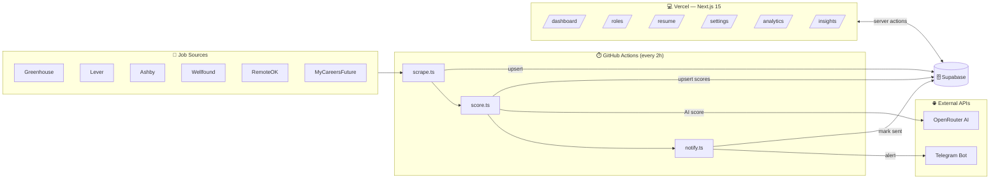

# 🧠 Job Intelligence Platform

> A self-hosted, AI-powered job discovery engine that scrapes, scores, and notifies — so you only see jobs that actually match your skills.

[](https://github.com/sahidhh/job-scraper/actions/workflows/ci.yml)

---

## ✨ What It Does

| Step | Description |
|---|---|
| 🔍 **Scrape** | Pulls fresh postings every 2 hours from Greenhouse, Lever, Ashby, Wellfound, RemoteOK & MyCareersFuture |
| 📍 **Filter** | Tags jobs by geography (India / Singapore / UAE / Remote) and drops irrelevant ones |
| 🎯 **Score** | Runs a two-stage pipeline — cheap keyword match first, then AI scoring via OpenRouter |
| 🔔 **Notify** | Sends a structured Telegram digest with inline Apply buttons for high-score matches |
| 📊 **Insights** | Shows skill gaps, skill demand, and analytics charts on a clean dashboard |

---

## 🗺️ Architecture at a Glance



---

## 🚀 Features

### 🏠 Dashboard
- Paginated, filterable, sortable job table
- Filter by **location**, **source**, **status**, **AI score range**
- Bulk status updates (Interested → Applied → Rejected → Archived)

### 🧬 AI Scoring
- **Stage 1 — Keyword:** Fast skill overlap score (free, always runs)
- **Stage 2 — AI:** OpenRouter LLM call with reasoning (only when keyword score ≥ threshold)
- Scores persist per `(job, role_selection)` pair — no re-scoring needed

### 📄 Resume Intelligence
- Upload PDF → auto-extracts text and tags skills against a built-in dictionary
- Manually add/edit skills after upload
- Skills drive both keyword and AI scoring

### 🎯 Role Targeting
- Enter your primary role → AI expands it to related titles (cached forever)
- Expansion filters scrapers, scopes scoring, and tightens notifications

### 🔔 Telegram Notifications
- **Digest mode** (`NOTIFY_MODE=digest`): one structured message per run with inline Apply buttons, score band counts, and optional "Worth Reviewing" + Dashboard shortcuts
- **Individual mode** (`NOTIFY_MODE=individual`): one message per matching job with title, company, location, and direct apply link
- At-most-once delivery guaranteed via `notifications_log` deduplication

### 📈 Insights & Analytics
- Skill gap analysis — what matched jobs need that your resume lacks
- Skill demand ranking — most-requested skills across all matches
- Charts: jobs over time, by source, score histogram, status breakdown

---

## 🧱 Tech Stack

| Layer | Technology |
|---|---|
| Framework | Next.js 15 (App Router, React 19) |
| Language | TypeScript 5 (strict) |
| Styling | Tailwind CSS 4 + shadcn/ui |
| Database | Supabase (Postgres 14.5 + Auth + Storage) |
| AI | OpenRouter API (model configurable) |
| Notifications | Telegram Bot API |
| Cron | GitHub Actions |
| Tests | Vitest |

> **Not used:** Prisma, Drizzle, Zustand, Redux, React Query — see [CLAUDE.md](CLAUDE.md) for why.

---

## 🛠️ Quick Setup

### Prerequisites
- [Supabase](https://supabase.com) account (free tier works)
- [Vercel](https://vercel.com) account
- [OpenRouter](https://openrouter.ai) API key
- Telegram bot (create via [@BotFather](https://t.me/BotFather))

### Steps

```bash
# 1. Clone & install
git clone https://github.com/sahidhh/job-scraper.git
cd job-scraper
npm install

# 2. Set up Supabase
#    Run migrations in supabase/migrations/ against your project
#    Run supabase/seed.sql for initial statuses and role map

# 3. Configure environment
cp .env.example .env.local
# Fill in NEXT_PUBLIC_SUPABASE_URL, NEXT_PUBLIC_SUPABASE_ANON_KEY,
# OPENROUTER_API_KEY, OPENROUTER_MODEL

# 4. Run locally
npm run dev

# 5. Add GitHub Actions secrets for cron
#    SUPABASE_URL, SUPABASE_SERVICE_ROLE_KEY,
#    OPENROUTER_API_KEY, OPENROUTER_MODEL,
#    TELEGRAM_BOT_TOKEN, TELEGRAM_CHAT_ID
```

### First Run
1. Log in → upload your PDF resume at `/resume`
2. Set your target role at `/roles`
3. Add company board tokens at `/settings`
4. **Optional:** validate boards before scraping via Actions → `Validate sources` → `Run workflow`
5. Trigger the scrape workflow manually via GitHub Actions → `workflow_dispatch`

---

## ⚙️ Environment Variables

| Variable | Where | Required |
|---|---|---|
| `NEXT_PUBLIC_SUPABASE_URL` | Vercel | ✅ |
| `NEXT_PUBLIC_SUPABASE_ANON_KEY` | Vercel | ✅ |
| `OPENROUTER_API_KEY` | Vercel + GH Actions | ✅ |
| `OPENROUTER_MODEL` | Vercel + GH Actions | ✅ |
| `SUPABASE_URL` | GH Actions | ✅ |
| `SUPABASE_SERVICE_ROLE_KEY` | GH Actions only | ✅ |
| `TELEGRAM_BOT_TOKEN` | GH Actions | ✅ |
| `TELEGRAM_CHAT_ID` | GH Actions | ✅ |
| `KEYWORD_THRESHOLD` | GH Actions | ⬜ default `0.25` |
| `NOTIFY_THRESHOLD` | GH Actions | ⬜ default `0.75` |
| `WELLFOUND_FEED_URL` | GH Actions | ⬜ Wellfound feed URL (see [docs/sources/wellfound.md](docs/sources/wellfound.md)) |
| `WELLFOUND_DISABLED` | GH Actions | ⬜ Set `true` to disable Wellfound without a config warning |

---

## 🧪 Development

```bash
npm run dev          # local dev server
npm test             # run unit tests
npm run typecheck    # TypeScript check
npm run check:service-role-boundary  # CI safety gate
npm run scrape       # manual scrape run
npm run score        # manual scoring run
npm run notify       # manual notification run
npm run validate-sources  # probe ATS boards; report dead tokens
```

---

## 📁 Project Structure

```
src/
  app/          # Next.js pages & server actions
  features/     # Feature modules (domain/application/infrastructure)
    jobs/       resume/   roles/   scoring/
    sources/    notifications/   insights/   companies/
  shared/       # HTTP utils, Supabase clients, skills dictionary
  components/   # shadcn/ui components
supabase/
  migrations/   # Forward-only SQL migrations
  seed.sql      # Initial statuses + role expansion map
scripts/
  scrape.ts   score.ts   notify.ts   # Cron entry points
design/         # 📐 Technical design documents
docs/           # 📖 Architecture & operational docs
```

---

## 📐 Design Documents

Full technical documentation lives in [`design/`](design/):

- [Technical Design](design/technical-design.md)
- [Architecture](design/architecture.md)
- [Entity Relationship Diagram](design/erd.md)
- [Tech Stack](design/tech-stack.md)
- [Use Cases](design/use-cases.md)
- [Scope & Roadmap](design/scope.md)
- [Limitations](design/limitations.md)
- [User Guide](design/user-guide.md)
- [API Reference](design/api-reference.md)
- [Security Design](design/security.md)

---

## 📜 License

Personal use / self-hosted. Not licensed for redistribution.
