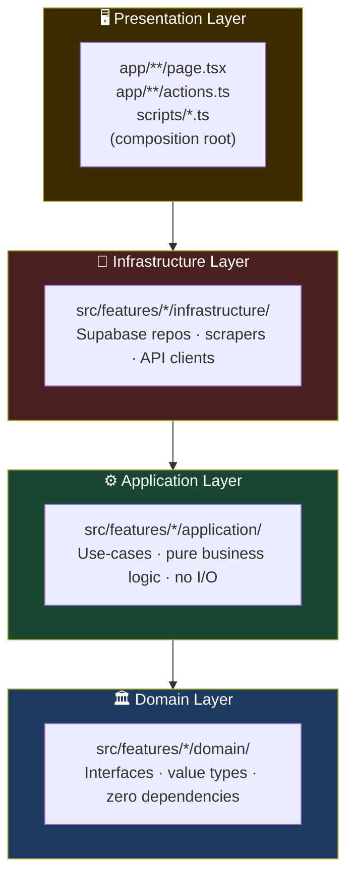
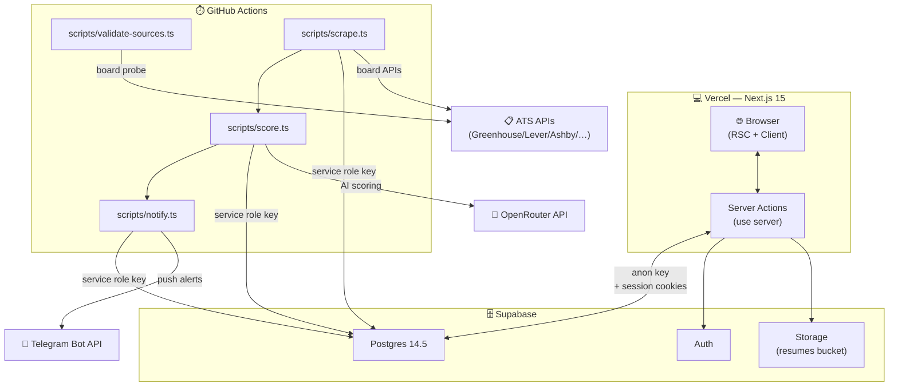
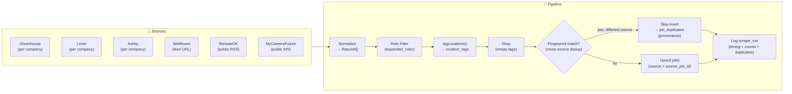
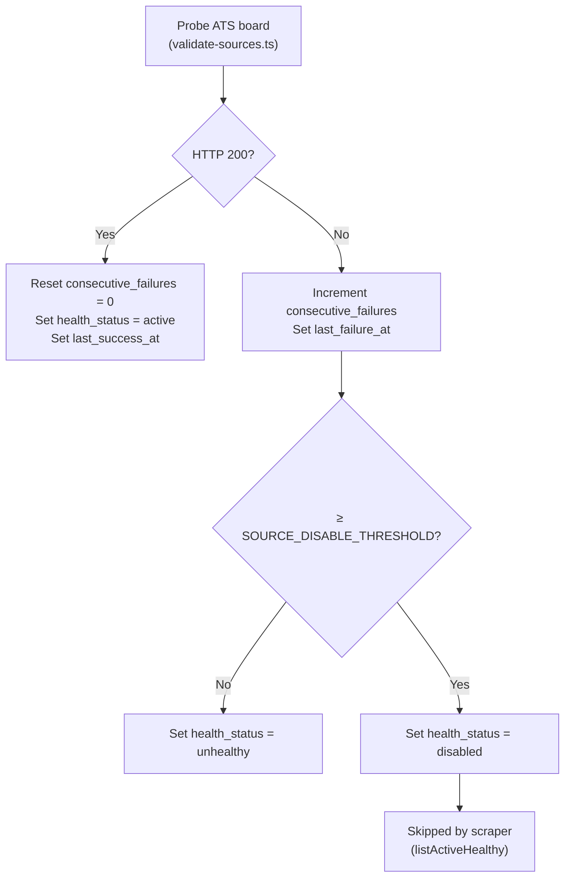
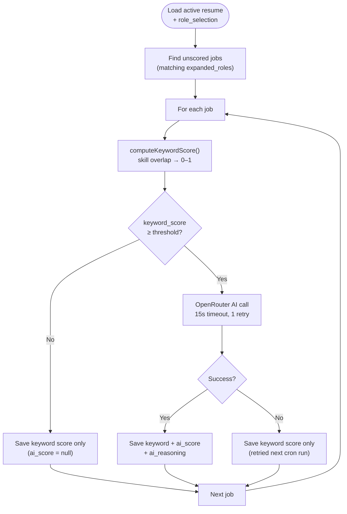
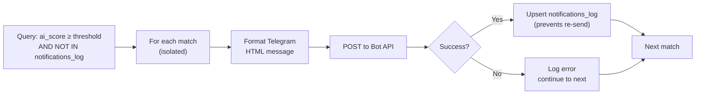
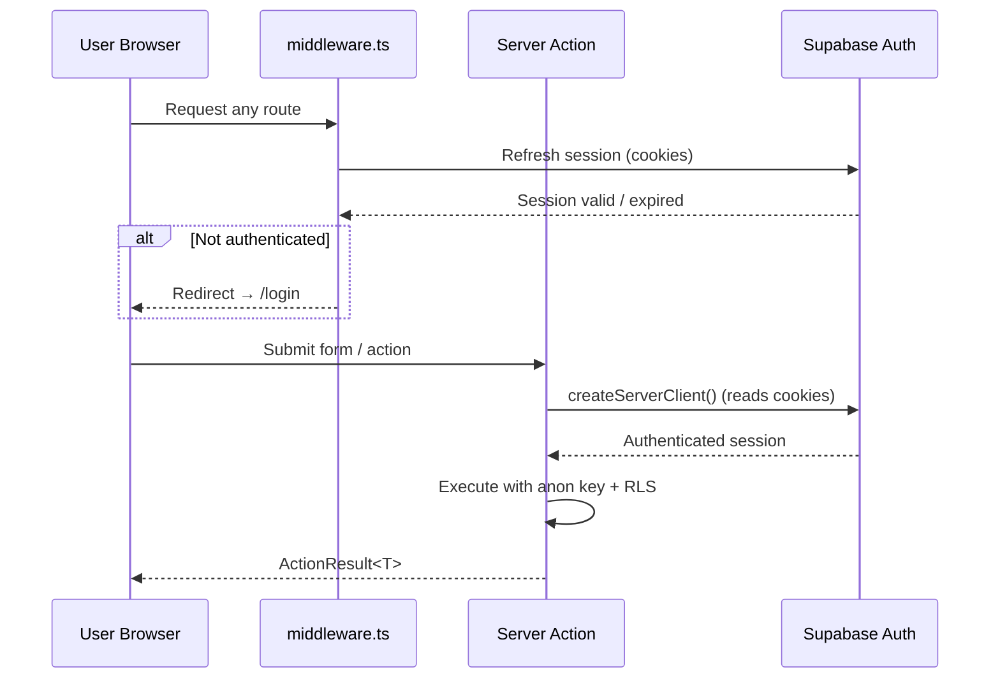
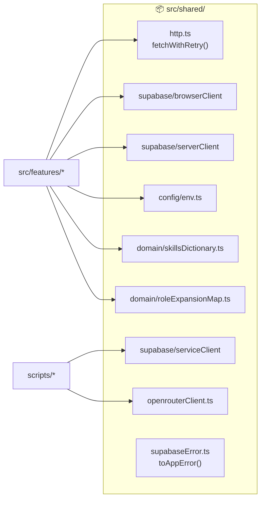

# System Architecture

## 1. Clean Architecture Layers

Dependencies flow strictly inward — outer layers depend on inner, never the reverse.



### Layer Rules

| Rule | Enforcement |
|---|---|
| Domain has zero imports from other layers | TypeScript strict + code review |
| Application depends only on domain interfaces | Interfaces injected as function args |
| Infrastructure implements domain interfaces | Concrete classes satisfy interfaces |
| No feature imports another feature's infrastructure | Module boundary review |
| `shared/` has no feature dependencies | Import direction check |

---

## 2. Feature Module Structure

Every feature follows the same layout:

```
src/features/<feature>/
  domain/
    types.ts          ← interfaces and value types
    errors.ts         ← domain-specific errors (optional)
  application/
    <use-case>.ts     ← pure function, deps injected
    <use-case>.test.ts
  infrastructure/
    Supabase<Repo>.ts      ← implements domain interface
    Supabase<Repo>.test.ts
  actions.ts          ← Next.js server actions (presentation)
```

---

## 3. Runtime Topology



---

## 4. Scrape Pipeline



Cross-source duplicate detection (Phase 1 Task 1-3, `computeFingerprint.ts`): before a job with a
new `(source, source_job_id)` is inserted, its fingerprint (normalized title + canonical company +
sorted location tags) is checked against every existing job regardless of source. A match means the
same logical posting was already ingested elsewhere -- it is recorded in `job_duplicates` for
provenance instead of becoming a second `jobs` row, so scoring and notifications run once per
logical job. Jobs already known by `(source, source_job_id)` always go through the normal
update path, unaffected by the fingerprint check.

---

## 5. Source Health Tracking



The three health states:

| State | Meaning | Scraper behavior |
|---|---|---|
| `active` | Probing succeeds | Included in scrape runs |
| `unhealthy` | Consecutive failures below threshold | Included in scrape runs |
| `disabled` | Failures ≥ SOURCE_DISABLE_THRESHOLD | Excluded from scrape runs |

### 5.1 Source-Level Health Summary (Phase 1 Task 5/7)

The probe-based tracking above only covers board-token sources (greenhouse/lever/ashby) via their
`companies` rows, and only reacts to the separate `validate-sources.ts` cron -- a company whose
*actual scrape* fails is invisible to it until the next probe run (AD-13/AD-16 follow-up). A second,
independent signal now covers every source uniformly, including the feed-based ones with no
`companies` row (wellfound/remoteok/mycareersfuture):

```
scrape.ts catch/success path
  → classifyScrapeFailure(error) or 'empty_feed' (found_count === 0 on success)
  → scrape_runs.failure_category
  → computeSourceHealthSummary(source, recent scrape_runs)
  → { successRate, avgLatencyMs, consecutiveFailures, lastSuccessAt/lastFailureAt,
      recoveryDetected, topFailureCategory, recommendation }
  → getSourceHealthReport(): one summary per registered source
```

Failure categories (`classifyScrapeFailure.ts`, deterministic keyword/status heuristics, no AI):
`timeout | parsing | selector | captcha | blocked | authentication | rate_limited | not_found |
empty_feed | unknown`. `selector`/`captcha` are extension points -- no current adapter does
HTML/DOM scraping or hits a CAPTCHA wall. `getSourceHealthReport()` is surfaced on `/analytics`
(Phase 4 Task 13).

---

## 6. Scoring Pipeline



Every save goes through the `upsert_job_score` RPC (erd.md), which atomically increments `retry_count`
whenever the write leaves `ai_score` null. After each `score.ts` run, `getScoringQueueReport()` (Phase 1
Task 6) queries `ScoreRepository.findAwaitingAi` (keyword gate passed, `ai_score IS NULL`, ordered
oldest `scored_at` first) and computes `{ awaitingAiCount, oldestPendingAgeHours, stuckJobs,
maxRetryCount, avgRetryCount }` via the pure `computeScoringQueueSummary`. "Stuck" jobs (waiting past
`SCORING_STUCK_THRESHOLD_HOURS`, default 48h) are logged as a warning -- AD-14 already retries
indefinitely, so this is visibility, not a new retry mechanism. `getScoringQueueReport()` is
surfaced on `/analytics` (Phase 4 Task 13).

---

## 7. Notification Pipeline



---

## 8. Authentication Flow



---

## 9. Database Access Matrix

| Caller | Client | Key | RLS |
|---|---|---|---|
| RSC / client components | `browserClient` | anon key | enforced |
| Server actions | `serverClient` (SSR) | anon key + session | enforced |
| Cron scripts | `serviceClient` | service role key | **bypassed** |

The service role is **only** imported in `scripts/` — enforced by the `check:service-role-boundary` CI gate.

---

## 10. Shared Infrastructure (`src/shared/`)


