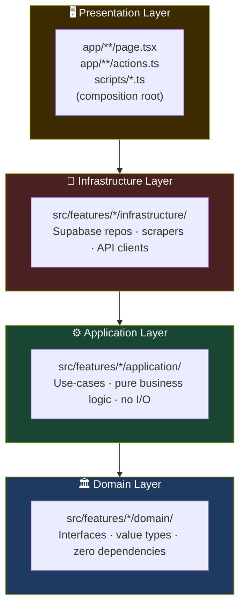
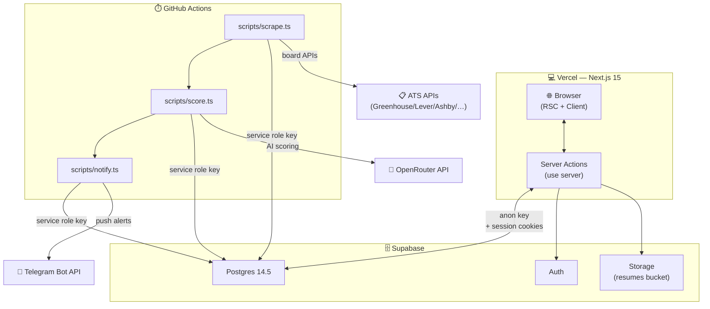
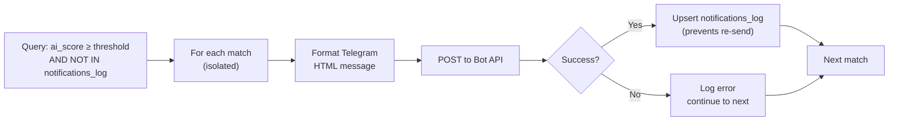
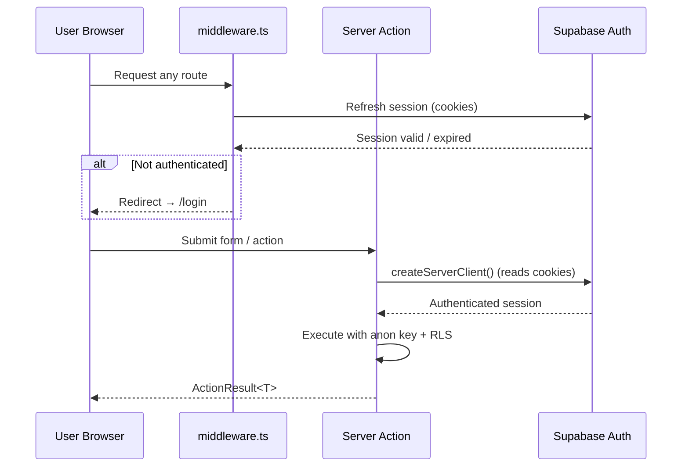
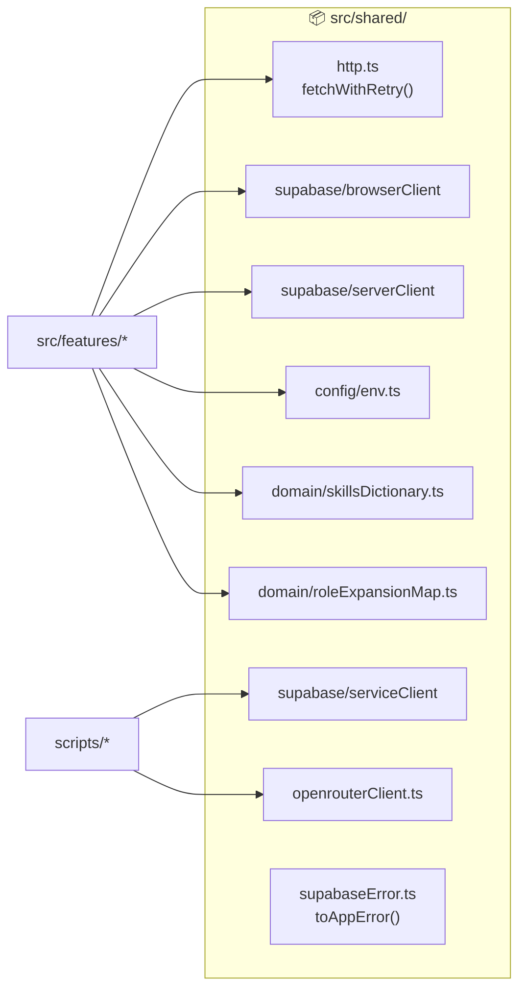

# System Architecture

## 1. Clean Architecture Layers

Dependencies flow strictly inward — outer layers depend on inner, never the reverse.



### Layer Rules

| Rule | Enforcement |
|---|---|
| Domain has zero imports from other layers | TypeScript strict + code review |
| Application depends only on domain interfaces | Interfaces injected as function args |
| Infrastructure implements domain interfaces | Concrete classes satisfy interfaces |
| No feature imports another feature's infrastructure | Module boundary review |
| `shared/` has no feature dependencies | Import direction check |

---

## 2. Feature Module Structure

Every feature follows the same layout:

```
src/features/<feature>/
  domain/
    types.ts          ← interfaces and value types
    errors.ts         ← domain-specific errors (optional)
  application/
    <use-case>.ts     ← pure function, deps injected
    <use-case>.test.ts
  infrastructure/
    Supabase<Repo>.ts      ← implements domain interface
    Supabase<Repo>.test.ts
  actions.ts          ← Next.js server actions (presentation)
```

---

## 3. Runtime Topology



---

## 4. Scrape Pipeline

```mermaid
flowchart LR
    subgraph sources ["📡 Sources"]
        GH["Greenhouse\n(per company)"]
        LV["Lever\n(per company)"]
        AS["Ashby\n(per company)"]
        WF["Wellfound\n(feed URL)"]
        RO["RemoteOK\n(public RSS)"]
        MC["MyCareersFuture\n(public API)"]
    end

    subgraph pipeline ["🔄 Pipeline"]
        N["Normalize\n→ RawJob[]"]
        F["Role Filter\n(expanded_roles)"]
        T["tagLocations()\n→ location_tags"]
        D["Drop\n(empty tags)"]
        U["Upsert jobs\n(source + source_job_id)"]
        L["Log scrape_run\n(timing + counts)"]
    end

    sources --> N --> F --> T --> D --> U --> L
```



---

## 5. Scoring Pipeline


---

## 6. Notification Pipeline



---

## 7. Authentication Flow



---

## 8. Database Access Matrix

| Caller | Client | Key | RLS |
|---|---|---|---|
| RSC / client components | `browserClient` | anon key | enforced |
| Server actions | `serverClient` (SSR) | anon key + session | enforced |
| Cron scripts | `serviceClient` | service role key | **bypassed** |

The service role is **only** imported in `scripts/` — enforced by the `check:service-role-boundary` CI gate.

---

## 9. Shared Infrastructure (`src/shared/`)


