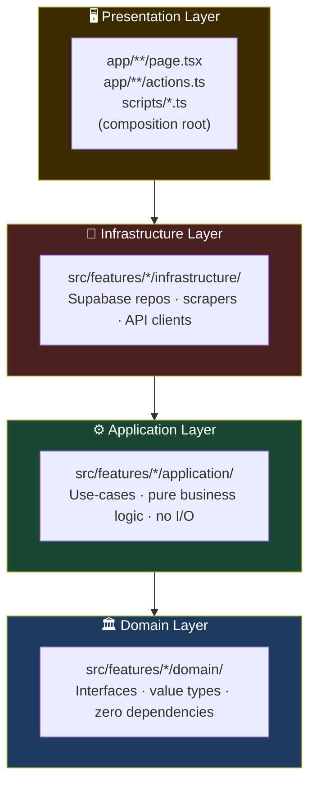
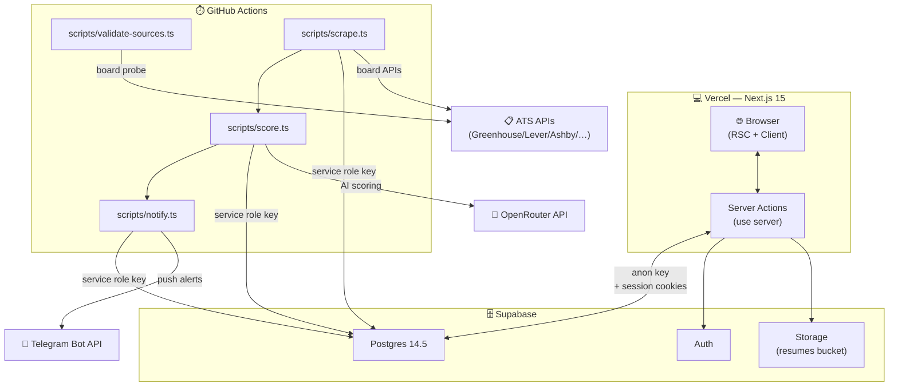
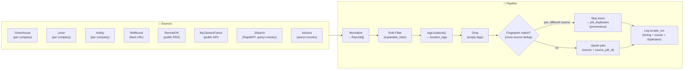
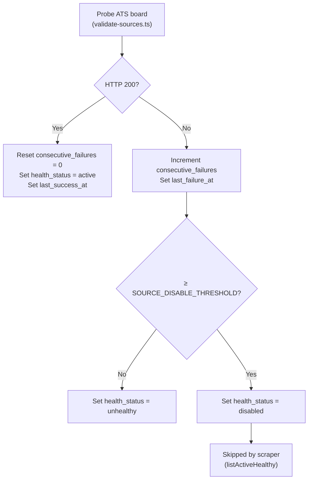
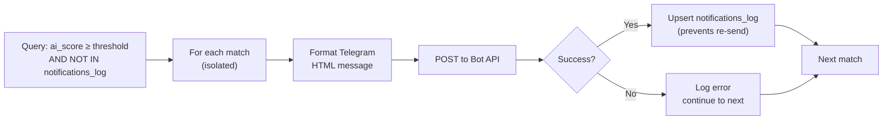
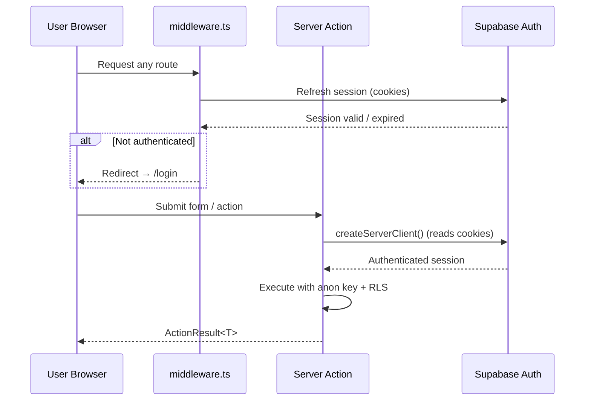
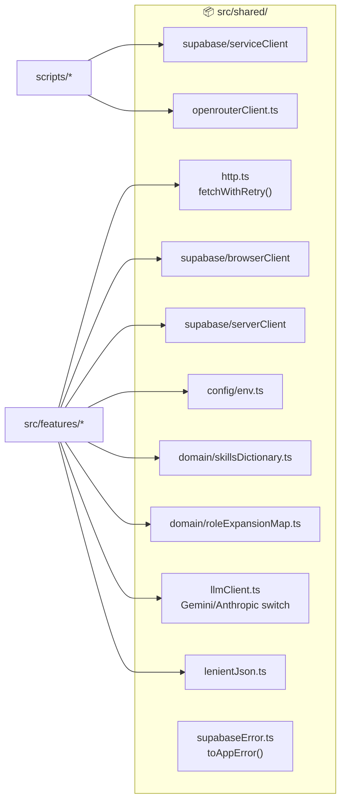
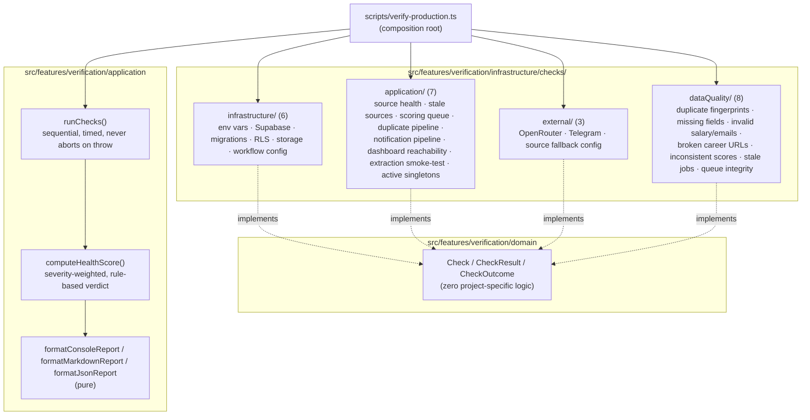

# System Architecture

## 1. Clean Architecture Layers

Dependencies flow strictly inward — outer layers depend on inner, never the reverse.



### Layer Rules

| Rule | Enforcement |
|---|---|
| Domain has zero imports from other layers | TypeScript strict + code review |
| Application depends only on domain interfaces | Interfaces injected as function args |
| Infrastructure implements domain interfaces | Concrete classes satisfy interfaces |
| No feature imports another feature's infrastructure | Module boundary review |
| `shared/` has no feature dependencies | Import direction check |

---

## 2. Feature Module Structure

Every feature follows the same layout:

```
src/features/<feature>/
  domain/
    types.ts          ← interfaces and value types
    errors.ts         ← domain-specific errors (optional)
  application/
    <use-case>.ts     ← pure function, deps injected
    <use-case>.test.ts
  infrastructure/
    Supabase<Repo>.ts      ← implements domain interface
    Supabase<Repo>.test.ts
  actions.ts          ← Next.js server actions (presentation)
```

---

## 3. Runtime Topology



---

## 4. Scrape Pipeline



Cross-source duplicate detection (Phase 1 Task 1-3, `computeFingerprint.ts`): before a job with a
new `(source, source_job_id)` is inserted, its fingerprint (normalized title + canonical company +
sorted location tags) is checked against every existing job regardless of source. A match means the
same logical posting was already ingested elsewhere -- it is recorded in `job_duplicates` for
provenance instead of becoming a second `jobs` row, so scoring and notifications run once per
logical job. Jobs already known by `(source, source_job_id)` always go through the normal
update path, unaffected by the fingerprint check.

### 4.1 JSearch and Adzuna (merge-workspace Phase 5)

Both are query/country-search aggregator APIs (unlike the feed-only adapters above), so each issues
one HTTP request per `(search term, target country)` combo -- same "issue N requests instead of one
big feed" shape as MyCareersFuture -- capped at 2 search terms to keep worst-case requests-per-run
small (`JSearchScraper.ts`/`AdzunaScraper.ts`, `MAX_SEARCH_TERMS`). JSearch indexes Google for Jobs
(surfacing LinkedIn/Indeed/Glassdoor/company listings through one legal aggregator API, not direct
scraping of those sites -- `design/scope.md` §4). Adzuna's covered-country list does not include the
UAE (`design/limitations.md` §1.1); only India/Singapore of this platform's three target regions are
reachable through it. Both fix jobhunt bug #4: an entry with no genuine, stable ID from the source is
rejected outright rather than substituting an unstable fallback (e.g. an apply/redirect link, which
can carry per-request tracking tokens) as `sourceJobId` -- the `(source, source_job_id)` upsert key
this diagram's "Upsert jobs" step relies on must actually be stable across re-fetches of the same
posting, or the job silently re-inserts as "new" on every run instead of updating in place.

### 4.2 Static Careers-URL Fetcher (merge-workspace Phase 5, manual-trigger only)

A third new source, `careers_url`, ports jobhunt/sources.py's `fetch_company_careers`: given one
operator-provided public careers page URL, it fetches the page (static HTML only -- no headless
browser, same limitation jobhunt's own docstring states), strips it to plain text, and LLM-extracts
listed roles via `LlmCareersPageExtractor`/`llmClient.ts` (Phase 3's provider-agnostic abstraction).
It is **not** in the `sources` subgraph/`sourceScrapers` registry above and does not run on
`scrape.ts`'s cron loop -- `CareersUrlScraper.ts`'s `fetchCareersUrlJobs` takes a URL argument the
registry's uniform `fetchJobs(companies, roles)` shape has no place for, and there is no expected
run cadence to track. It is invoked on demand via `scripts/scrape-careers-url.ts`
(`npm run scrape:careers-url -- <url>`), which otherwise reuses the exact same
tagLocations → hasAllowedLocation → ingestJobs → recordRun pipeline as every other source. See
`docs/decisions.md` AD-35 for why `careers_url` is a valid `JobSource` value (the jobs table needs
it) but is deliberately excluded from `JOB_SOURCES` (the source-health-tracked, notification-filter
set) -- including it there would make every health check flag it "stale" forever after its first run.

---

## 5. Source Health Tracking



The three health states:

| State | Meaning | Scraper behavior |
|---|---|---|
| `active` | Probing succeeds | Included in scrape runs |
| `unhealthy` | Consecutive failures below threshold | Included in scrape runs |
| `disabled` | Failures ≥ SOURCE_DISABLE_THRESHOLD | Excluded from scrape runs |

### 5.1 Source-Level Health Summary (Phase 1 Task 5/7)

The probe-based tracking above only covers board-token sources (greenhouse/lever/ashby) via their
`companies` rows, and only reacts to the separate `validate-sources.ts` cron -- a company whose
*actual scrape* fails is invisible to it until the next probe run (AD-13/AD-16 follow-up). A second,
independent signal now covers every source uniformly, including the feed-based ones with no
`companies` row (wellfound/remoteok/mycareersfuture):

```
scrape.ts catch/success path
  → classifyScrapeFailure(error) or 'empty_feed' (found_count === 0 on success)
  → scrape_runs.failure_category
  → computeSourceHealthSummary(source, recent scrape_runs)
  → { successRate, avgLatencyMs, consecutiveFailures, lastSuccessAt/lastFailureAt,
      recoveryDetected, topFailureCategory, hoursSinceLastRun, isStale, recommendation }
  → getSourceHealthReport(): one summary per registered source
```

Failure categories (`classifyScrapeFailure.ts`, deterministic keyword/status heuristics, no AI):
`timeout | parsing | selector | captcha | blocked | authentication | rate_limited | not_found |
empty_feed | unknown`. `selector`/`captcha` are extension points -- no current adapter does
HTML/DOM scraping or hits a CAPTCHA wall. `getSourceHealthReport()` is surfaced on `/analytics`
(Phase 4 Task 13).

**Stale detection** (`SOURCE_HEALTH_CONFIG.staleAfterHours`, default 6h -- 3x the ~2h scrape
cadence, env `SOURCE_STALE_HOURS`): a source with no run at all in that window is flagged
`isStale`, a distinct condition from "running and failing" -- covers a source silently dropped
from `JOB_SOURCES`/the workflow, or a crashed job that skipped it entirely, neither of which
produces a `scrape_runs` row for `consecutiveFailures` to ever see. The stale recommendation
takes priority over a failing-streak recommendation on the same source. Surfaced on `/analytics`
via `ScrapeRunHealthTable`'s "stale" badge, sorted to the top.

---

## 6. Scoring Pipeline

```mermaid
flowchart TD
    START(["Load active resume\n+ role_selection"]) --> QUERY["Find unscored jobs\n(matching expanded_roles)"]
    QUERY --> EACH["For each job"]
    EACH --> KW["computeKeywordScore()\nskill overlap → 0–1"]
    KW --> GATE{keyword_score\n≥ threshold?}
    GATE -- No --> SAVE_KW["Save keyword score only\n(ai_score = null)"]
    GATE -- Yes --> ELIG{classifyEligibility()\nhard-excluded?}
    ELIG -- Yes --> SAVE_KW["Save keyword score only\n(ai_score = null, no AI call)"]
    ELIG -- No --> AI["OpenRouter AI call\n15s timeout, 1 retry"]
    AI --> AI_OK{Success?}
    AI_OK -- Yes --> CAP["capAiScoreForEligibility()\nclamp onsite foreign +\nunconfirmed sponsorship → ≤ 0.40"]
    CAP --> OVERALL["computeOverallScore()\nai_score + configurable bonuses"]
    OVERALL --> SAVE_AI["Save keyword + ai_score\n+ ai_reasoning + overall_score"]
    AI_OK -- No --> SAVE_KW2["Save keyword score only\n(retried next cron run)"]
    SAVE_KW --> NEXT
    SAVE_AI --> NEXT
    SAVE_KW2 --> NEXT
    NEXT["Next job"] --> EACH
```

**Eligibility pre-filter** (`classifyEligibility.ts`, scoring-accuracy session): a deterministic gate
between the keyword gate and the AI call. The candidate is India-based and needs visa sponsorship for
any onsite role, so a job is hard-excluded (skips the AI call, no tokens spent) when it is either a
**remote** posting geo-locked to a region the candidate does not qualify for (e.g. "US residents
only"), or an **onsite** posting with an explicit no-sponsorship/authorization-required signal (e.g.
"not able to sponsor", "citizens only"). Both phrase lists are editable config
(`shared/config/candidate-constraints.ts`) matched case-insensitively against `locationRaw` +
`description` -- no new columns. Onsite postings that are merely *silent* on sponsorship are **not**
excluded here (unconfirmed, not disqualified) -- they still reach the AI call, whose system prompt
(`OpenRouterAiScoreProvider.ts`) now also carries the candidate's constraints (location/sponsorship
need, ~years of experience, primary/secondary stack) and instructs the model that a sponsorship-silent
onsite posting, a seniority mismatch, or a primary-stack mismatch each caps the score below a "strong"
match, regardless of skill-keyword overlap.

**Code-enforced sponsorship cap** (`capAiScoreForEligibility.ts`, AD-53): the prompt cap above proved
insufficient — the model recites the sponsorship constraint in its reasoning yet still emits a high
number. So after a successful AI call, the score is clamped **deterministically in code** to ≤ 0.40 when
the job is onsite (not `remote`-tagged) in a foreign sponsorship market (`singapore`/`uae`, no `india`
fallback) and the model's returned `sponsorshipConfirmed` flag is false. The model classifies; the code
does the arithmetic. Remote, India-onsite, and sponsorship-confirmed roles pass through untouched.

Every save goes through the `upsert_job_score` RPC (erd.md), which atomically increments `retry_count`
whenever the write leaves `ai_score` null. After each `score.ts` run, `getScoringQueueReport()` (Phase 1
Task 6) queries `ScoreRepository.findAwaitingAi` (keyword gate passed, `ai_score IS NULL`, underlying
job still `is_active` -- `docs/decisions.md` AD-45 -- ordered oldest `scored_at` first) and computes
`{ awaitingAiCount, oldestPendingAgeHours, stuckJobs, maxRetryCount, avgRetryCount }` via the pure
`computeScoringQueueSummary`. "Stuck" jobs (waiting past `SCORING_STUCK_THRESHOLD_HOURS`, default 48h)
are logged as a warning -- AD-14 already retries indefinitely, so this is visibility, not a new retry
mechanism. `getScoringQueueReport()` is surfaced on `/analytics` (Phase 4 Task 13).

**Composite ranking score** (`computeOverallScore.ts`, Theme 1 continuous-improvement pass):
whenever `ai_score` is set, `overall_score = ai_score` plus small additive bonuses -- preferred
company, remote (if `RankingPreferences.preferRemote`), and salary disclosed -- each configurable
via `RankingPreferences` (`app_settings` key `ranking_preferences`, `/settings` → Ranking). Reasons
applied are stored alongside as `overall_score_reasons` and shown next to the score on the
dashboard. `overall_score` (not `ai_score`) is the dashboard's default sort key; `posted_at desc`
remains the tiebreaker, which already covers freshness without double-weighting it into the bonus
formula. Deliberately not ML/embeddings-based -- see `docs/decisions.md` AD-26.

---

## 7. Notification Pipeline



`filterMatches()` applies `NotificationPreferences` before a match reaches formatting: role/skill/
location/experience/source include-filters (P1.5, all ANDed), plus `excludeCompanies`/
`excludeEmploymentTypes`/`excludeKeywords` mutes (continuous-improvement pass) -- all three mutes are
also enforced on the dashboard job list (`JobFilters.excludeCompanies`/`excludeEmploymentTypes`/
`excludeKeywords`, shared settings), so a mute is a genuine "never show me this" rather than only
suppressing the alert.

---

## 8. Authentication Flow



---

## 9. Database Access Matrix

| Caller | Client | Key | RLS |
|---|---|---|---|
| RSC / client components | `browserClient` | anon key | enforced |
| Server actions | `serverClient` (SSR) | anon key + session | enforced |
| Cron scripts | `serviceClient` | service role key | **bypassed** |

The service role is **only** imported in `scripts/` — enforced by the `check:service-role-boundary` CI gate.

---

## 10. Shared Infrastructure (`src/shared/`)



**Note on `llmClient.ts` vs `openrouterClient.ts` (decisions.md AD-32, AD-42):** two separate AI-client *abstractions* still exist deliberately — `openrouterClient.ts`'s `callOpenRouterJson` backs `AiScoreProvider` (job-vs-resume scoring, scoring.md §3) with a strict JSON-schema constraint; `llmClient.ts` backs `ResumeSuggestionProvider` (resume coaching), `ApplicationDraftProvider` (AD-34), and `CareersPageExtractor` (AD-35) with free-text/lenient-JSON calls. They were not merged into one interface because those call shapes genuinely differ. However, as of AD-42, `llmClient.ts`'s **default** provider (`LLM_PROVIDER=openrouter`) routes through `openrouterClient.ts`'s new `callOpenRouterCompletion` (a second, non-schema-constrained function in that same module) and the same `OPENROUTER_API_KEY` scoring already requires — so in practice, only one provider key is needed by default. `gemini`/`anthropic` (direct REST, no OpenRouter involved) remain available via `LLM_PROVIDER` for anyone who wants `llmClient.ts`'s callers on a different key/provider than scoring.

---

## 11. Production Verification Framework (v1.4)



Same clean-architecture shape as every other feature (§1): domain has zero dependencies, application
is pure orchestration (no I/O), infrastructure implements the `Check` interface, and the script is the
composition root. Checks reuse existing reports rather than re-deriving them —
`app.source-health`/`app.stale-sources` wrap `getSourceHealthReport()`, `app.scoring-queue` wraps
`getScoringQueueReport()` — mirroring AD-24's "surface, don't merge" precedent. Exposed as
`npm run verify:production` / `npm run diagnostics`; see `docs/operations/production-verification.md`
for the full check catalog and `docs/decisions.md` AD-27 for the design rationale.
