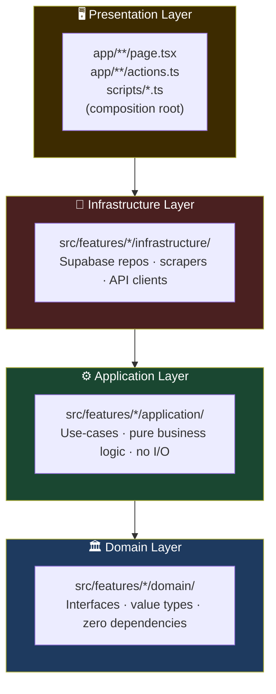
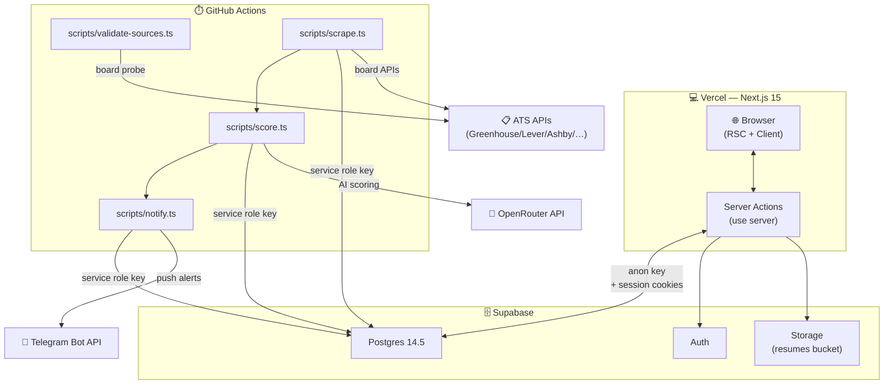
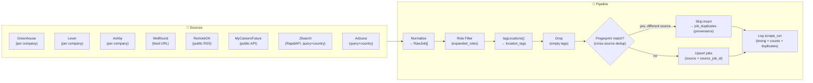
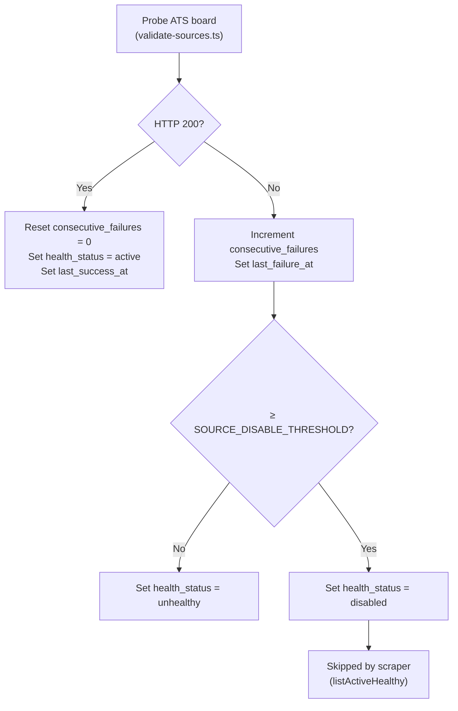
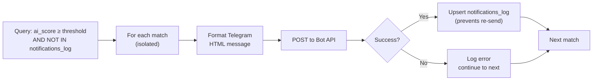
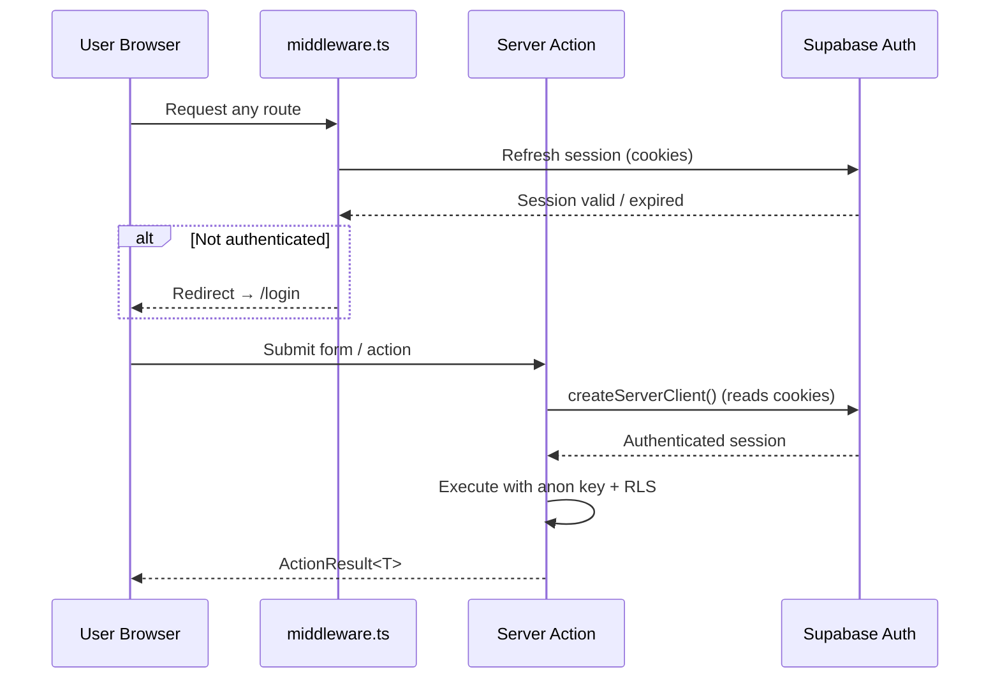
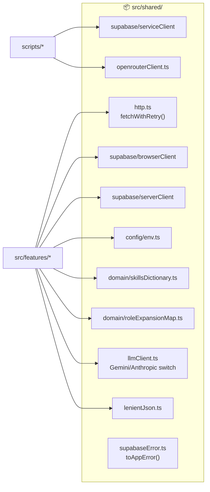
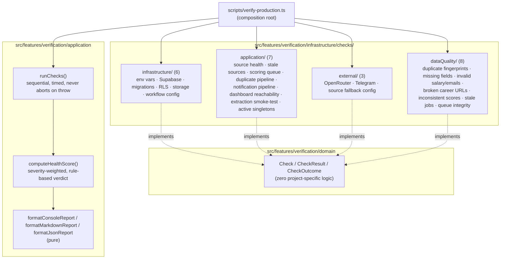

# System Architecture

## 1. Clean Architecture Layers

Dependencies flow strictly inward — outer layers depend on inner, never the reverse.


```mermaid
flowchart TB
    subgraph P ["🖥️ Presentation Layer"]
        PA["app/**/page.tsx\napp/**/actions.ts\nscripts/*.ts\n(composition root)"]
    end
    subgraph I ["🔧 Infrastructure Layer"]
        IA["src/features/*/infrastructure/\nSupabase repos · scrapers · API clients"]
    end
    subgraph A ["⚙️ Application Layer"]
        AA["src/features/*/application/\nUse-cases · pure business logic · no I/O"]
    end
    subgraph D ["🏛️ Domain Layer"]
        DA["src/features/*/domain/\nInterfaces · value types · zero dependencies"]
    end

    P --> I --> A --> D

    style D fill:#1e3a5f,color:#fff
    style A fill:#1a4731,color:#fff
    style I fill:#4a2020,color:#fff
    style P fill:#3d2b00,color:#fff
```

### Layer Rules

| Rule | Enforcement |
|---|---|
| Domain has zero imports from other layers | TypeScript strict + code review |
| Application depends only on domain interfaces | Interfaces injected as function args |
| Infrastructure implements domain interfaces | Concrete classes satisfy interfaces |
| No feature imports another feature's infrastructure | Module boundary review |
| `shared/` has no feature dependencies | Import direction check |

---

## 2. Feature Module Structure

Every feature follows the same layout:

```
src/features/<feature>/
  domain/
    types.ts          ← interfaces and value types
    errors.ts         ← domain-specific errors (optional)
  application/
    <use-case>.ts     ← pure function, deps injected
    <use-case>.test.ts
  infrastructure/
    Supabase<Repo>.ts      ← implements domain interface
    Supabase<Repo>.test.ts
  actions.ts          ← Next.js server actions (presentation)
```

---

## 3. Runtime Topology


```mermaid
flowchart TB
    subgraph vercel ["💻 Vercel — Next.js 15"]
        Browser["🌐 Browser\n(RSC + Client)"]
        Actions["Server Actions\n(use server)"]
        Browser <--> Actions
    end

    subgraph supabase ["🗄️ Supabase"]
        PG["Postgres 14.5"]
        Auth["Auth"]
        Storage["Storage\n(resumes bucket)"]
    end

    subgraph gha ["⏱️ GitHub Actions"]
        Validate["scripts/validate-sources.ts"]
        Scrape["scripts/scrape.ts"]
        Score["scripts/score.ts"]
        Notify["scripts/notify.ts"]
        Scrape --> Score --> Notify
    end

    Actions <-->|"anon key\n+ session cookies"| PG
    Actions --> Auth
    Scrape -->|"service role key"| PG
    Score -->|"service role key"| PG
    Notify -->|"service role key"| PG

    Score -->|"AI scoring"| OpenRouter["🤖 OpenRouter API"]
    Notify -->|"push alerts"| Telegram["📱 Telegram Bot API"]
    Scrape -->|"board APIs"| ATS["📋 ATS APIs\n(Greenhouse/Lever/Ashby/…)"]
    Validate -->|"board probe"| ATS
    Actions --> Storage
```

---

## 4. Scrape Pipeline


```mermaid
flowchart LR
    subgraph sources ["📡 Sources"]
        GH["Greenhouse\n(per company)"]
        LV["Lever\n(per company)"]
        AS["Ashby\n(per company)"]
        WF["Wellfound\n(feed URL)"]
        RO["RemoteOK\n(public RSS)"]
        MC["MyCareersFuture\n(public API)"]
        JS["JSearch\n(RapidAPI, query+country)"]
        AZ["Adzuna\n(query+country)"]
    end

    subgraph pipeline ["🔄 Pipeline"]
        N["Normalize\n→ RawJob[]"]
        F["Role Filter\n(expanded_roles)"]
        T["tagLocations()\n→ location_tags"]
        D["Drop\n(empty tags)"]
        FP{"Fingerprint match?\n(cross-source dedup)"}
        SKIP["Skip insert\n→ job_duplicates (provenance)"]
        U["Upsert jobs\n(source + source_job_id)"]
        L["Log scrape_run\n(timing + counts + duplicates)"]
    end

    sources --> N --> F --> T --> D --> FP
    FP -- "yes, different source" --> SKIP --> L
    FP -- "no" --> U --> L
```

Cross-source duplicate detection (Phase 1 Task 1-3, `computeFingerprint.ts`): before a job with a
new `(source, source_job_id)` is inserted, its fingerprint (normalized title + canonical company +
sorted location tags) is checked against every existing job regardless of source. A match means the
same logical posting was already ingested elsewhere -- it is recorded in `job_duplicates` for
provenance instead of becoming a second `jobs` row, so scoring and notifications run once per
logical job. Jobs already known by `(source, source_job_id)` always go through the normal
update path, unaffected by the fingerprint check.

### 4.1 JSearch and Adzuna (merge-workspace Phase 5)

Both are query/country-search aggregator APIs (unlike the feed-only adapters above), so each issues
one HTTP request per `(search term, target country)` combo -- same "issue N requests instead of one
big feed" shape as MyCareersFuture -- capped at 2 search terms to keep worst-case requests-per-run
small (`JSearchScraper.ts`/`AdzunaScraper.ts`, `MAX_SEARCH_TERMS`). JSearch indexes Google for Jobs
(surfacing LinkedIn/Indeed/Glassdoor/company listings through one legal aggregator API, not direct
scraping of those sites -- `design/scope.md` §4). Adzuna's covered-country list does not include the
UAE (`design/limitations.md` §1.1); only India/Singapore of this platform's three target regions are
reachable through it. Both fix jobhunt bug #4: an entry with no genuine, stable ID from the source is
rejected outright rather than substituting an unstable fallback (e.g. an apply/redirect link, which
can carry per-request tracking tokens) as `sourceJobId` -- the `(source, source_job_id)` upsert key
this diagram's "Upsert jobs" step relies on must actually be stable across re-fetches of the same
posting, or the job silently re-inserts as "new" on every run instead of updating in place.

### 4.2 Static Careers-URL Fetcher (merge-workspace Phase 5, manual-trigger only)

A third new source, `careers_url`, ports jobhunt/sources.py's `fetch_company_careers`: given one
operator-provided public careers page URL, it fetches the page (static HTML only -- no headless
browser, same limitation jobhunt's own docstring states), strips it to plain text, and LLM-extracts
listed roles via `LlmCareersPageExtractor`/`llmClient.ts` (Phase 3's provider-agnostic abstraction).
It is **not** in the `sources` subgraph/`sourceScrapers` registry above and does not run on
`scrape.ts`'s cron loop -- `CareersUrlScraper.ts`'s `fetchCareersUrlJobs` takes a URL argument the
registry's uniform `fetchJobs(companies, roles)` shape has no place for, and there is no expected
run cadence to track. It is invoked on demand via `scripts/scrape-careers-url.ts`
(`npm run scrape:careers-url -- <url>`), which otherwise reuses the exact same
tagLocations → hasAllowedLocation → ingestJobs → recordRun pipeline as every other source. See
`docs/decisions.md` AD-35 for why `careers_url` is a valid `JobSource` value (the jobs table needs
it) but is deliberately excluded from `JOB_SOURCES` (the source-health-tracked, notification-filter
set) -- including it there would make every health check flag it "stale" forever after its first run.

---

## 5. Source Health Tracking


```mermaid
flowchart TD
    PROBE["Probe ATS board\n(validate-sources.ts)"] --> OK{HTTP 200?}
    OK -- Yes --> RESET["Reset consecutive_failures = 0\nSet health_status = active\nSet last_success_at"]
    OK -- No --> INC["Increment consecutive_failures\nSet last_failure_at"]
    INC --> THRESH{≥ SOURCE_DISABLE_THRESHOLD?}
    THRESH -- No --> UNHEALTHY["Set health_status = unhealthy"]
    THRESH -- Yes --> DISABLED["Set health_status = disabled"]
    DISABLED --> SKIP["Skipped by scraper\n(listActiveHealthy)"]
```

The three health states:

| State | Meaning | Scraper behavior |
|---|---|---|
| `active` | Probing succeeds | Included in scrape runs |
| `unhealthy` | Consecutive failures below threshold | Included in scrape runs |
| `disabled` | Failures ≥ SOURCE_DISABLE_THRESHOLD | Excluded from scrape runs |

### 5.1 Source-Level Health Summary (Phase 1 Task 5/7)

The probe-based tracking above only covers board-token sources (greenhouse/lever/ashby) via their
`companies` rows, and only reacts to the separate `validate-sources.ts` cron -- a company whose
*actual scrape* fails is invisible to it until the next probe run (AD-13/AD-16 follow-up). A second,
independent signal now covers every source uniformly, including the feed-based ones with no
`companies` row (wellfound/remoteok/mycareersfuture):

```
scrape.ts catch/success path
  → classifyScrapeFailure(error) or 'empty_feed' (found_count === 0 on success)
  → scrape_runs.failure_category
  → computeSourceHealthSummary(source, recent scrape_runs)
  → { successRate, avgLatencyMs, consecutiveFailures, lastSuccessAt/lastFailureAt,
      recoveryDetected, topFailureCategory, hoursSinceLastRun, isStale, recommendation }
  → getSourceHealthReport(): one summary per registered source
```

Failure categories (`classifyScrapeFailure.ts`, deterministic keyword/status heuristics, no AI):
`timeout | parsing | selector | captcha | blocked | authentication | rate_limited | not_found |
empty_feed | unknown`. `selector`/`captcha` are extension points -- no current adapter does
HTML/DOM scraping or hits a CAPTCHA wall. `getSourceHealthReport()` is surfaced on `/analytics`
(Phase 4 Task 13).

**Stale detection** (`SOURCE_HEALTH_CONFIG.staleAfterHours`, default 6h -- 3x the ~2h scrape
cadence, env `SOURCE_STALE_HOURS`): a source with no run at all in that window is flagged
`isStale`, a distinct condition from "running and failing" -- covers a source silently dropped
from `JOB_SOURCES`/the workflow, or a crashed job that skipped it entirely, neither of which
produces a `scrape_runs` row for `consecutiveFailures` to ever see. The stale recommendation
takes priority over a failing-streak recommendation on the same source. Surfaced on `/analytics`
via `ScrapeRunHealthTable`'s "stale" badge, sorted to the top.

---

## 6. Scoring Pipeline

```mermaid
flowchart TD
    START(["Load active resume\n+ role_selection"]) --> QUERY["Find unscored jobs\n(matching expanded_roles)"]
    QUERY --> EACH["For each job"]
    EACH --> KW["computeKeywordScore()\nskill overlap → 0–1"]
    KW --> GATE{keyword_score\n≥ threshold?}
    GATE -- No --> SAVE_KW["Save keyword score only\n(ai_score = null)"]
    GATE -- Yes --> ELIG{classifyEligibility()\nhard-excluded?}
    ELIG -- Yes --> SAVE_KW["Save keyword score only\n(ai_score = null, no AI call)"]
    ELIG -- No --> AI["OpenRouter AI call\n15s timeout, 1 retry"]
    AI --> AI_OK{Success?}
    AI_OK -- Yes --> CAP["capAiScoreForEligibility()\nclamp onsite foreign +\nunconfirmed sponsorship → ≤ 0.40"]
    CAP --> OVERALL["computeOverallScore()\nai_score + configurable bonuses"]
    OVERALL --> SAVE_AI["Save keyword + ai_score\n+ ai_reasoning + overall_score"]
    AI_OK -- No --> SAVE_KW2["Save keyword score only\n(retried next cron run)"]
    SAVE_KW --> NEXT
    SAVE_AI --> NEXT
    SAVE_KW2 --> NEXT
    NEXT["Next job"] --> EACH
```

**Eligibility pre-filter** (`classifyEligibility.ts`, scoring-accuracy session): a deterministic gate
between the keyword gate and the AI call. The candidate is India-based and needs visa sponsorship for
any onsite role, so a job is hard-excluded (skips the AI call, no tokens spent) when it is either a
**remote** posting geo-locked to a region the candidate does not qualify for (e.g. "US residents
only"), or an **onsite** posting with an explicit no-sponsorship/authorization-required signal (e.g.
"not able to sponsor", "citizens only"). Both phrase lists are editable config
(`shared/config/candidate-constraints.ts`) matched case-insensitively against `locationRaw` +
`description` -- no new columns. Onsite postings that are merely *silent* on sponsorship are **not**
excluded here (unconfirmed, not disqualified) -- they still reach the AI call, whose system prompt
(`OpenRouterAiScoreProvider.ts`) now also carries the candidate's constraints (location/sponsorship
need, ~years of experience, primary/secondary stack) and instructs the model that a sponsorship-silent
onsite posting, a seniority mismatch, or a primary-stack mismatch each caps the score below a "strong"
match, regardless of skill-keyword overlap.

**Code-enforced sponsorship cap** (`capAiScoreForEligibility.ts`, AD-53): the prompt cap above proved
insufficient — the model recites the sponsorship constraint in its reasoning yet still emits a high
number. So after a successful AI call, the score is clamped **deterministically in code** to ≤ 0.40 when
the job is onsite (not `remote`-tagged) in a foreign sponsorship market (`singapore`/`uae`, no `india`
fallback) and the model's returned `sponsorshipConfirmed` flag is false. The model classifies; the code
does the arithmetic. Remote, India-onsite, and sponsorship-confirmed roles pass through untouched.

Every save goes through the `upsert_job_score` RPC (erd.md), which atomically increments `retry_count`
whenever the write leaves `ai_score` null. After each `score.ts` run, `getScoringQueueReport()` (Phase 1
Task 6) queries `ScoreRepository.findAwaitingAi` (keyword gate passed, `ai_score IS NULL`, underlying
job still `is_active` -- `docs/decisions.md` AD-45 -- ordered oldest `scored_at` first) and computes
`{ awaitingAiCount, oldestPendingAgeHours, stuckJobs, maxRetryCount, avgRetryCount }` via the pure
`computeScoringQueueSummary`. "Stuck" jobs (waiting past `SCORING_STUCK_THRESHOLD_HOURS`, default 48h)
are logged as a warning -- AD-14 already retries indefinitely, so this is visibility, not a new retry
mechanism. `getScoringQueueReport()` is surfaced on `/analytics` (Phase 4 Task 13).

**Composite ranking score** (`computeOverallScore.ts`, Theme 1 continuous-improvement pass):
whenever `ai_score` is set, `overall_score = ai_score` plus small additive bonuses -- preferred
company, remote (if `RankingPreferences.preferRemote`), and salary disclosed -- each configurable
via `RankingPreferences` (`app_settings` key `ranking_preferences`, `/settings` → Ranking). Reasons
applied are stored alongside as `overall_score_reasons` and shown next to the score on the
dashboard. `overall_score` (not `ai_score`) is the dashboard's default sort key; `posted_at desc`
remains the tiebreaker, which already covers freshness without double-weighting it into the bonus
formula. Deliberately not ML/embeddings-based -- see `docs/decisions.md` AD-26.

---

## 7. Notification Pipeline


```mermaid
flowchart LR
    Q["Query: ai_score ≥ threshold\nAND NOT IN notifications_log"] --> EACH["For each match\n(isolated)"]
    EACH --> FMT["Format Telegram\nHTML message"]
    FMT --> SEND["POST to Bot API"]
    SEND --> OK{Success?}
    OK -- Yes --> LOG["Upsert notifications_log\n(prevents re-send)"]
    OK -- No --> SKIP["Log error\ncontinue to next"]
    LOG --> NEXT["Next match"]
    SKIP --> NEXT
```

`filterMatches()` applies `NotificationPreferences` before a match reaches formatting: role/skill/
location/experience/source include-filters (P1.5, all ANDed), plus `excludeCompanies`/
`excludeEmploymentTypes`/`excludeKeywords` mutes (continuous-improvement pass) -- all three mutes are
also enforced on the dashboard job list (`JobFilters.excludeCompanies`/`excludeEmploymentTypes`/
`excludeKeywords`, shared settings), so a mute is a genuine "never show me this" rather than only
suppressing the alert.

---

## 8. Authentication Flow


```mermaid
sequenceDiagram
    participant U as User Browser
    participant M as middleware.ts
    participant SA as Server Action
    participant SB as Supabase Auth

    U->>M: Request any route
    M->>SB: Refresh session (cookies)
    SB-->>M: Session valid / expired
    alt Not authenticated
        M-->>U: Redirect → /login
    end
    U->>SA: Submit form / action
    SA->>SB: createServerClient() (reads cookies)
    SB-->>SA: Authenticated session
    SA->>SA: Execute with anon key + RLS
    SA-->>U: ActionResult<T>
```

---

## 9. Database Access Matrix

| Caller | Client | Key | RLS |
|---|---|---|---|
| RSC / client components | `browserClient` | anon key | enforced |
| Server actions | `serverClient` (SSR) | anon key + session | enforced |
| Cron scripts | `serviceClient` | service role key | **bypassed** |

The service role is **only** imported in `scripts/` — enforced by the `check:service-role-boundary` CI gate.

---

## 10. Shared Infrastructure (`src/shared/`)


```mermaid
flowchart LR
    subgraph shared ["📦 src/shared/"]
        HTTP["http.ts\nfetchWithRetry()"]
        BC["supabase/browserClient"]
        SC["supabase/serverClient"]
        SVC["supabase/serviceClient"]
        OR["openrouterClient.ts"]
        LLM["llmClient.ts\nGemini/Anthropic switch"]
        LJSON["lenientJson.ts"]
        ENV["config/env.ts"]
        DICT["domain/skillsDictionary.ts"]
        RMAP["domain/roleExpansionMap.ts"]
        ERR["supabaseError.ts\ntoAppError()"]
    end

    Features["src/features/*"] --> HTTP
    Features --> BC
    Features --> SC
    Scripts["scripts/*"] --> SVC
    Scripts --> OR
    Features --> ENV
    Features --> DICT
    Features --> RMAP
    Features --> LLM
    Features --> LJSON
```

**Note on `llmClient.ts` vs `openrouterClient.ts` (decisions.md AD-32, AD-42):** two separate AI-client *abstractions* still exist deliberately — `openrouterClient.ts`'s `callOpenRouterJson` backs `AiScoreProvider` (job-vs-resume scoring, scoring.md §3) with a strict JSON-schema constraint; `llmClient.ts` backs `ResumeSuggestionProvider` (resume coaching), `ApplicationDraftProvider` (AD-34), and `CareersPageExtractor` (AD-35) with free-text/lenient-JSON calls. They were not merged into one interface because those call shapes genuinely differ. However, as of AD-42, `llmClient.ts`'s **default** provider (`LLM_PROVIDER=openrouter`) routes through `openrouterClient.ts`'s new `callOpenRouterCompletion` (a second, non-schema-constrained function in that same module) and the same `OPENROUTER_API_KEY` scoring already requires — so in practice, only one provider key is needed by default. `gemini`/`anthropic` (direct REST, no OpenRouter involved) remain available via `LLM_PROVIDER` for anyone who wants `llmClient.ts`'s callers on a different key/provider than scoring.

---

## 11. Production Verification Framework (v1.4)


```mermaid
flowchart TB
    subgraph domain ["src/features/verification/domain"]
        TYPES["Check / CheckResult / CheckOutcome\n(zero project-specific logic)"]
    end
    subgraph application ["src/features/verification/application"]
        RUN["runChecks()\nsequential, timed, never aborts on throw"]
        SCORE["computeHealthScore()\nseverity-weighted, rule-based verdict"]
        FMT["formatConsoleReport / formatMarkdownReport / formatJsonReport\n(pure)"]
    end
    subgraph infra ["src/features/verification/infrastructure/checks/"]
        INFRA_C["infrastructure/ (6)\nenv vars · Supabase · migrations · RLS · storage · workflow config"]
        APP_C["application/ (7)\nsource health · stale sources · scoring queue · duplicate pipeline ·\nnotification pipeline · dashboard reachability · extraction smoke-test · active singletons"]
        EXT_C["external/ (3)\nOpenRouter · Telegram · source fallback config"]
        DQ_C["dataQuality/ (8)\nduplicate fingerprints · missing fields · invalid salary/emails ·\nbroken career URLs · inconsistent scores · stale jobs · queue integrity"]
    end
    SCRIPT["scripts/verify-production.ts\n(composition root)"]

    SCRIPT --> INFRA_C & APP_C & EXT_C & DQ_C
    INFRA_C & APP_C & EXT_C & DQ_C -.implements.-> TYPES
    SCRIPT --> RUN --> SCORE --> FMT
```

Same clean-architecture shape as every other feature (§1): domain has zero dependencies, application
is pure orchestration (no I/O), infrastructure implements the `Check` interface, and the script is the
composition root. Checks reuse existing reports rather than re-deriving them —
`app.source-health`/`app.stale-sources` wrap `getSourceHealthReport()`, `app.scoring-queue` wraps
`getScoringQueueReport()` — mirroring AD-24's "surface, don't merge" precedent. Exposed as
`npm run verify:production` / `npm run diagnostics`; see `docs/operations/production-verification.md`
for the full check catalog and `docs/decisions.md` AD-27 for the design rationale.

---

## 12. Presentation Layer (composition, navigation, state)

Layers 1–11 stop at the server action. This section covers what happens above it. It exists because
the presentation layer is the one place with no enforced rule file — there is no `check:` script for
"did you put state in the right place" — so the conventions have to be written down.

### 12.1 Composition rule

**Server component by default; a client component is a leaf.**

```
page.tsx (server)          fetch via repository → pass plain props down
  └─ Section (server)      layout, banners, empty states
       └─ Widget (client)  "use client" only if it needs state, an event, or a transition
```

A component earns `"use client"` by needing browser state — nothing else. `FilterBar`, `SkillsEditor`,
`JobsTable`, `JobStatusSelect`, `BottomNav`, and `RouteTabs` are client components; every data-shaped
component around them is a server component receiving props. This is why no data-fetching library is
needed, and why React Query is banned (tech-stack.md §2): the fetch already happened on the server.

Data crosses the boundary as **plain serialisable props**, never as a repository instance or a class.
A client component that needs data it wasn't given calls a server action, not a repository.

**Logic that two components share lives in a plain module beside them, not in whichever one wrote it
first.** Several surfaces exist as a desktop/mobile pair rendering the same concept — `JobRow` and
`JobCard`, `JobStatusSelect` and `JobStatusSheet` — and a rule copied into both drifts the moment one
is edited. `src/components/dashboard/jobScore.ts` is the reference case: it holds `formatScore`, the
0.75/0.40 score bands and the `Pending · N%` label fixed by decisions.md AD-56, and both `ScoreBadge`
and `ScorePill` import them rather than each carrying a copy. `jobHotkeys.ts` is the same shape for
the shortcut table (§12.6). These modules carry no `"use client"` and no JSX — they are pure
functions and constants, which is what makes them testable in the node environment (§12.6,
technical-design.md §11).

### 12.2 The three navigation surfaces

| Surface | Component | Scope | Rendered |
|---|---|---|---|
| Primary nav | `AppShell` `<aside>` | The six feature areas | Desktop only (`hidden md:flex`) |
| Primary nav (mobile) | `BottomNav` | Same six areas | Mobile only (`md:hidden`) |
| Section nav | `RouteTabs` | Sub-routes within Analytics and Settings | Both |

The six primary items and their order are declared **once**, in
`src/components/layout/navItems.ts`: Dashboard, Roles, Resume, Insights, Analytics, Settings.
Any surface that renders primary navigation must read that array — a nav surface with its own
hardcoded list is a bug, because it drifts silently (see limitations.md §10.4 for the instance of this
that currently exists).

`RouteTabs` is deliberately **route-based, not a `Tabs` primitive**: each tab is a real route with its
own server fetch and its own `loading.tsx`, so opening a tab streams only that tab's data. This is the
architectural reason Analytics and Settings are split into sub-routes while Dashboard and Insights are
not — those two have a single data-bearing section each (`docs/frontend.md` §1).

### 12.3 State management

There is no state library and there will not be one (tech-stack.md §2). State lives in exactly four
places, in this order of preference:

1. **The URL** — all dashboard filters. `?q`, `?location`, `?source`, `?status`, `?minScore`,
   `?maxYears`, `?remote`, `?ineligible`, `?lowmatch`, `?archived`, `?limit`. This is the default for
   anything a user would expect to survive a refresh, a back button, or a shared link. `FilterBar`
   never holds filter values in `useState`; it reads `useSearchParams()` and navigates.

   A free-text field that writes URL state **commits on Enter and on blur, and navigates once for
   both.** Enter comes from a real `<form onSubmit>` wrapping the field with a `hidden` submit
   button, not a hand-rolled `onKeyDown` — that way implicit submission is the platform's, including
   the "Go"/"Search" key on mobile soft keyboards. Because Enter leaves focus in the field, the blur
   that follows would fire a second identical `router.push`; a `lastCommitted` ref holds the last
   value sent and short-circuits the duplicate. `FilterBar`'s `FilterInput` implements this once for
   search, min-score and max-years across both the desktop toolbar and the mobile sheet, and
   `RoleSelectorForm` uses the same shape so Enter in the role input triggers Expand. Reach for
   `onKeyDown` only when a key a form does not give you is required — `ExpandedRolesCard`'s
   `AddRoleChip` keeps one because it also needs Escape to cancel (limitations.md §10.9).
2. **The server** — everything persisted. Mutations go through a server action, which is a composition
   root: it instantiates the repository and calls the same use-case a cron script would
   (`docs/architecture.md` §5 rule 4), then `revalidatePath()`.
3. **`useTransition` + `router.refresh()`** — the pending state of a mutation. The pattern is
   uniform: wrap the action call in `startTransition`, disable the control while `isPending`, refresh
   on resolve so the server re-runs the filtered query. `DashboardNavigationProvider` exists only to
   share one such pending flag between `FilterBar` and `JobsTable`, so the table can dim
   (`aria-busy`) while a filter navigation is in flight.
4. **`useState`** — ephemeral, non-persisted UI only: an open dialog, an expanded row, a mobile
   filter sheet, a bulk-selection set. Nothing here should survive a refresh, and nothing here is
   derived from server data.

**Optimistic updates are used in exactly one place: the per-job status control.** `JobStatusSelect`
(desktop) and `JobStatusSheet` (mobile) both hold the chosen status in local state, show it
immediately, and **put the previous value back when the action returns `ok: false`** — optimistic
without rollback is the thing that is banned, because a value that appears to change and silently
reverts is worse than one that never moved. Both also re-sync from their `statusId` prop in an
effect: `JobRow`/`JobCard` do not remount on `router.refresh()`, so a status changed elsewhere (the
`r`/`a` shortcuts, the reject/archive buttons, a bulk update) would otherwise never reach the
control and it would keep showing a stale value. Everything else — bulk status, filters, drafts —
calls the action and refreshes, with no optimistic layer.

A control that opens a surface to make its choice is **controlled, and closes on select.**
`JobStatusSheet`'s `<Sheet>` takes `open`/`onOpenChange` for exactly this reason; left uncontrolled,
picking a status left the sheet sitting open over the result.

### 12.4 Loading, empty, and error conventions

| State | Convention |
|---|---|
| Route-level loading | `loading.tsx` per route segment, `animate-pulse` blocks mirroring the real layout's shape. **All six protected routes have one** — Dashboard, Roles, Resume and Insights were added in the UI/UX audit pass; Analytics and Settings already had theirs. A new route segment ships with its skeleton |
| In-page loading | `<Suspense>` around the data-bearing section (`JobsSection` on Dashboard, the skills section on Insights) |
| Filter-change loading | Not a spinner over the page — the existing list stays visible, dims to `opacity-60`, sets `aria-busy`, and an `aria-live="polite"` "Updating…" indicator appears beside the filters |
| Empty | Written per screen, in the component that owns the query, and must say *why* it is empty and what to do — "No jobs match the current filters" is a different message from "No jobs scraped yet" and both exist |
| Error | Route error boundaries (`app/error.tsx`, `app/global-error.tsx`); server actions return `{ ok: false, error }` rather than throwing across the boundary |

The filter-change convention is the load-bearing one: because filters are URL state, every filter
change is a navigation, and replacing the list with a skeleton on each keystroke-adjacent change would
make the screen flash. Preserve-and-dim is the rule for any future URL-driven list.

Routes without a nested `layout.tsx` — Dashboard, Roles, Resume, Insights — keep the page heading
*inside* the Suspense boundary, so their `loading.tsx` has to draw the heading too or the title pops
in on hydration and shoves the page down. Analytics and Settings do not, because their headings live
in a shared segment layout.

**Empty and error are separate states and must render separately.** `CompanyHistoryPanel` is the
worked example of getting this wrong: a failed `getCompanyHistoryAction` used to fall through to "No
prior applications found." — the one message that reads as a confident answer. A client component
that calls an action holds `data` and `error` independently, renders the action's `error` string when
it is set, and tells the user how to retry.

### 12.5 Accessibility baseline

Not a formal WCAG commitment — a single-user internal tool — but these are the conventions in place and
worth keeping:

- Interactive controls are real elements (`<button>`, `<select>`, `<input>`, `<label>`), which is most
  of why the Radix primitives were chosen over custom widgets.
- The active `RouteTabs` tab carries `aria-current="page"`; the dimmed job table carries `aria-busy`;
  the "Updating…" indicator is `aria-live="polite"`.
- Every icon-only control needs an accessible name, via `aria-label` — not `title`, which assistive
  tech treats as a hint rather than a name and which never reaches a touch user at all. `JobRow`'s
  reject and archive buttons carry an `aria-label` naming both the action and the job ("Reject
  &lt;title&gt;") and keep `title` only for the hover tooltip. The external-link and mail affordances in `JobRow`/`JobCard` are the other
  places to check when adding one.
- A control that shows and hides a region carries `aria-expanded`. Both the desktop row's title
  button and the mobile card's tap area do. This is also what makes `table.tsx`'s
  `has-aria-expanded:bg-muted/50` rule live — before the row had the attribute, that CSS matched
  nothing.
- **Never nest an interactive element inside another one.** A `<button>` containing an
  `<input type="checkbox">` is invalid HTML, and screen readers fold the checkbox into the button's
  accessible name. `JobCard`'s select checkbox is a `<label>`-wrapped sibling of the expand button,
  not a descendant of it; both keep a 44px tap target.
- `disabled` does nothing on an anchor. A link that must be inert during a transition needs
  `pointer-events-none` (visual/pointer), `tabIndex={-1}` (keyboard), `aria-disabled` (assistive
  tech) **and** a `preventDefault` guard in its click handler. `ApplicationDraftDialog`'s "Open in
  mail client" is the reference — it stays an `<a href="mailto:…">` because scope.md forbids the app
  sending mail itself, so the inert state has to be assembled by hand.
- Colour is never the only signal: the score badge carries its number, the status pill carries its
  label, and eligibility carries a reason badge.
- Radix warns when a dialog-role surface has no description. `SheetContent` sets
  `aria-describedby={undefined}` **before** the props spread — a deliberate opt-out, since our sheets
  are short titled surfaces where the title is the description, and declaring it before the spread
  means a caller that does render `<SheetDescription>` still wins.

### 12.6 Keyboard interaction (job table)

The dashboard table is the only surface with keyboard shortcuts, and the model is worth stating
because it is the shape any future shortcut should copy (decisions.md AD-60).

**One listener, one subject.** `JobsTable` registers exactly one `window` `keydown` listener for the
whole table, no matter how many rows render. The listener is registered once with an empty dependency
array and dispatches through a ref that is re-pointed at the current handler on every render — so
changing rows, statuses or the focused index never tears the subscription down and re-adds it. The
predecessor, `useDashboardHotkeys`, was called from `JobRow` and therefore registered one listener
*per row* while ignoring its `jobId` argument entirely: a single `r` rejected every job on the page.

**Roving focus.** Exactly one row is in the tab order (`tabIndex={0}`, the rest `-1`), so Tab enters
the table once rather than walking every row. `ArrowUp`/`ArrowDown` move the cursor and call
`.focus()` on the target row. The cursor is painted from `:focus-within` — a leading inset rail plus
an `accent/50` wash across the cells — not the 3px ring buttons use, because a ring reads as "this is
editable" and a row is a reading position, not a control. The wash sits on the `<td>`s because a
`<tr>` background renders underneath them.

**The decision is pure; the DOM part is an adapter.** `resolveJobHotkey()` in
`src/components/dashboard/jobHotkeys.ts` takes a plain `JobHotkeyEvent` (`key`, the three modifier
flags, `fromTextEntry`) and returns an action or `null`. It has no DOM types, so the whole
bail-out matrix is unit-tested in the node environment. Only `isTextEntryTarget()` touches the DOM.

Three guards, all mandatory:

| Guard | Why |
|---|---|
| Any of `metaKey`/`ctrlKey`/`altKey` → bail | Those combinations belong to the browser and the OS. `Ctrl+R` must reload, not reject |
| Target inside `input, textarea, select, [contenteditable], [role="combobox"], [role="listbox"], [role="menu"], [role="dialog"]` → bail | Not just literal text entry: Radix's select, menu and dialog run their own typeahead or trap the keyboard, and must keep every letter key they are given |
| Focus not inside the table `<tbody>` → bail | A shortcut needs a subject. Arrow keys also stop stealing page scrolling this way |

**The shortcut table is the legend.** `JOB_HOTKEYS` in the same module is read by both the handler
and the `<kbd>` legend rendered above the table, so the two cannot drift; the table is tied to the
legend with `aria-describedby`. An undiscoverable shortcut is not a feature — that was the other half
of what was wrong before.

The legend and the shortcuts are **desktop only**. The mobile card list has no focused-row concept to
act on, so it gets neither (limitations.md §10.8).
