# Entity Relationship Diagram

## Full ERD

```mermaid
erDiagram
    COMPANIES {
        uuid id PK
        text name
        text source "greenhouse | lever | ashby"
        text board_token
        boolean active
        timestamptz created_at
        source_health_status health_status "active | unhealthy | disabled"
        integer consecutive_failures "incremented on each probe failure"
        timestamptz last_success_at "nullable; set on healthy/redirected probe"
        timestamptz last_failure_at "nullable; set on failed probe"
    }

    COMPANY_CAREER_PAGES {
        uuid id PK
        text canonical_company_name UK "normalizeCompanyName() output -- not FK'd to COMPANIES.id"
        text career_page_url
        text website_url "nullable"
        text discovery_method "ats_board | domain_guess"
        text confidence "high | medium | low"
        timestamptz discovered_at
    }

    JOBS {
        uuid id PK
        text source "greenhouse | lever | ashby | wellfound | remoteok | mycareersfuture"
        text source_job_id
        uuid company_id FK "nullable"
        text company_name
        text canonical_company_name "normalizeCompanyName(company_name); legal/regional suffixes stripped"
        text title
        text location_raw
        text[] location_tags "india | singapore | uae | remote"
        text description
        text url
        timestamptz posted_at "nullable"
        timestamptz first_seen_at
        timestamptz last_seen_at "updated on every upsert"
        timestamptz updated_at
        integer min_years "nullable; CHECK 0-20; parsed at ingest + seniority-label fallback"
        boolean is_active "false when not seen for JOB_EXPIRATION_DAYS"
        text inactive_reason "nullable; 'expired' when set by sweep"
        text fingerprint "sha256(normalized title + canonical company + location tags); cross-source dedup key"
        text contact_email "nullable; best-effort, extractContactEmail.ts"
        text contact_email_category "nullable; recruiter | hr | hiring_manager | company_contact"
        text contact_email_confidence "nullable; high | medium | low"
        text salary_currency "nullable; INR | USD | SGD | AED, extractSalary.ts"
        numeric salary_min "nullable"
        numeric salary_max "nullable"
        text salary_period "nullable; yearly | monthly | hourly"
        text salary_confidence "nullable; high | medium | low"
        text employment_type "nullable; internship|contract|freelance|temporary|part_time|full_time, extractJobAttributes.ts"
        text seniority "nullable; executive|principal|lead|senior|entry|mid"
        text work_arrangement "nullable; hybrid|onsite (remote is location_tags, not this)"
        boolean visa_sponsorship "nullable; null=not mentioned, true=offered, false=explicitly not offered"
        boolean relocation_assistance "nullable; same tri-state as visa_sponsorship"
        boolean security_clearance "NOT NULL default false"
        boolean urgent_hiring "NOT NULL default false"
    }

    JOB_DUPLICATES {
        uuid id PK
        uuid canonical_job_id FK "-> JOBS; the one row kept for this logical job"
        text source "the OTHER source that also carries this posting"
        text source_job_id
        text url
        timestamptz first_seen_at
        timestamptz last_seen_at "refreshed each time this source re-scrapes the duplicate"
    }

    JOB_SCORES {
        uuid id PK
        uuid job_id FK
        uuid role_selection_id FK
        integer resume_version "resume version used for this score"
        real keyword_score "0.0 – 1.0, always set"
        real ai_score "0.0 – 1.0, null if below threshold or pending"
        text ai_reasoning "nullable"
        text model "OPENROUTER_MODEL used for this score; null if no AI call"
        integer tokens_input "prompt tokens from OpenRouter usage; null if no AI call"
        integer tokens_output "completion tokens from OpenRouter usage; null if no AI call"
        numeric estimated_cost_usd "cost estimate (tokens/1k * OPENROUTER_COST_PER_1K_TOKENS); null if env unset"
        timestamptz scored_at
        integer retry_count "incremented by upsert_job_score() whenever a write leaves ai_score null; never reset"
    }

    JOB_STATUSES {
        uuid id PK
        text label
        text color "CSS color string"
        integer sort_order
    }

    JOB_STATE {
        uuid job_id PK "FK → JOBS"
        uuid status_id FK "FK → JOB_STATUSES"
    }

    ROLE_PACKS {
        uuid id PK
        text name
        text description
        timestamptz created_at
    }

    ROLE_PACK_ROLES {
        uuid id PK
        uuid pack_id FK
        text role
        integer sort_order
    }

    ROLE_SELECTIONS {
        uuid id PK
        text primary_role
        text[] expanded_roles
        timestamptz created_at
        boolean is_active "UNIQUE partial index where true"
    }

    RESUMES {
        uuid id PK
        text file_path "Supabase Storage path"
        text parsed_text
        text[] skills
        integer version "monotonically increasing; set by set_active_resume"
        timestamptz uploaded_at
        boolean is_active "UNIQUE partial index where true"
    }

    ROLE_EXPANSION_MAP {
        text role PK
        text[] related_roles
        text source "seed | ai"
        timestamptz created_at
    }

    NOTIFICATIONS_LOG {
        uuid id PK
        uuid job_id UK "UNIQUE — one send per job"
        timestamptz sent_at
    }

    DIGEST_SESSIONS {
        uuid id PK
        uuid role_selection_id "FK — role selection used for this digest run"
        integer resume_version "resume version active at digest send time; DEFAULT 0"
        text[] worth_reviewing_job_ids "job IDs in the worth-reviewing band"
        bigint pagination_message_id "nullable — Telegram message_id once first page is shown"
        timestamptz created_at
    }

    SCRAPE_RUNS {
        uuid id PK
        text source
        text status "success | partial | failed"
        integer found_count
        integer kept_count "nullable; after location filter"
        integer inserted_count "nullable; net-new rows"
        integer updated_count "nullable; refreshed rows"
        integer duplicate_count "nullable; cross-source fingerprint duplicates skipped (job_duplicates)"
        text failure_category "nullable; classifyScrapeFailure.ts taxonomy, or 'empty_feed' on a successful zero-job run"
        integer failed_count "sub-run errors; 0 when source failed entirely"
        timestamptz started_at "nullable"
        timestamptz completed_at "nullable"
        integer duration_ms "nullable"
        text error "nullable"
        jsonb metadata "nullable; reserved for future use"
        timestamptz run_at
    }

    APP_SETTINGS {
        text key PK
        jsonb value
        timestamptz updated_at
    }

    ROLE_PACKS ||--o{ ROLE_PACK_ROLES : "contains"
    COMPANIES ||--o{ JOBS : "has (nullable)"
    JOBS ||--o{ JOB_SCORES : "scored by"
    ROLE_SELECTIONS ||--o{ JOB_SCORES : "scopes"
    JOBS ||--o| JOB_STATE : "has status"
    JOB_STATUSES ||--o{ JOB_STATE : "assigned to"
    JOBS ||--o| NOTIFICATIONS_LOG : "notified once"
    ROLE_SELECTIONS ||--o{ DIGEST_SESSIONS : "scopes"
    JOBS ||--o{ JOB_DUPLICATES : "rediscovered as"
```



---

## Key Constraints

| Table | Constraint | Purpose |
|---|---|---|
| `jobs` | `UNIQUE (source, source_job_id)` | Dedup on every ingest run |
| `jobs` | `GIN INDEX (location_tags)` | Fast array containment queries |
| `jobs` | `INDEX (fingerprint)` | Cross-source duplicate lookup on insert (not unique -- app-level check-then-skip, see `SupabaseJobRepository.upsertMany`) |
| `job_duplicates` | `UNIQUE (source, source_job_id)` | One provenance row per (other-source, id) rediscovery |
| `company_career_pages` | `UNIQUE (canonical_company_name)` | One career page per canonicalized company name, upserted on rediscovery |
| `job_scores` | `UNIQUE (job_id, role_selection_id, resume_version)` | One score per job+role+resume-version triple; prior-version rows preserved |
| `job_scores` | `INDEX (ai_score DESC NULLS LAST)` | Dashboard sorted by relevance |
| `job_scores` | `INDEX (role_selection_id, resume_version, scored_at) WHERE ai_score IS NULL` | `findAwaitingAi`'s unscored-queue shape |
| `jobs` | `INDEX (is_active)` | Active-jobs filter shared by `findUnscored`/`countMatchingExpandedRoles`/`countJobStats`/`markExpiredJobs` (created in `20260618000001_expired_job_detection.sql`, not repeated by the 2026-07-04 hardening migration) |
| `scrape_runs` | `INDEX (source, run_at DESC)` | `listRecentBySource` (per-source health report, called once per source per `/analytics` load) |
| `jobs` | `INDEX (employment_type)` | Notification-preference `excludeEmploymentTypes` filter reads this at digest time |
| `resumes` | `UNIQUE (is_active) WHERE is_active = true` | Enforce single active resume |
| `role_selections` | `UNIQUE (is_active) WHERE is_active = true` | Enforce single active role |
| `notifications_log` | `UNIQUE (job_id)` | Guarantee at-most-one Telegram send |
| `role_pack_roles` | `INDEX (pack_id)` | Fast lookup of roles for a pack |
| `companies` | `UNIQUE (source, board_token) WHERE board_token IS NOT NULL` | No duplicate board configs |
| `companies` | `INDEX (health_status)` | Fast lookup of unhealthy/disabled sources |
| `digest_sessions` | `INDEX (created_at DESC)` | Fast latest-session lookup for webhook pagination |

---

## Database Functions (RPC)

### `set_active_resume(file_path, parsed_text, skills[])`

```
1. Compute next_version = MAX(version) + 1
2. UPDATE resumes SET is_active = false   -- deactivate previous
3. INSERT INTO resumes (…, is_active = true, version = next_version)  -- activate new
4. RETURN new row
```

### `set_active_role_selection(primary_role, expanded_roles[])`

```
1. UPDATE role_selections SET is_active = false   -- deactivate previous
2. INSERT INTO role_selections (…, is_active = true)  -- activate new
3. RETURN new row
```

Both functions run in a single transaction, ensuring exactly one active record at all times.

### `upsert_job_score(p_job_id, p_role_selection_id, p_resume_version, p_keyword_score, p_ai_score, p_ai_reasoning, p_model, p_tokens_input, p_tokens_output, p_estimated_cost_usd)`

```
1. INSERT INTO job_scores (…) ON CONFLICT (job_id, role_selection_id, resume_version)
   DO UPDATE SET keyword_score/ai_score/ai_reasoning/model/tokens_*/estimated_cost_usd = excluded.*,
                 retry_count = job_scores.retry_count + (1 if excluded.ai_score IS NULL else 0)
```

Atomic single-round-trip write + conditional counter increment (Phase 1 Task 6) -- a plain client-side `.upsert()` can't express "increment only when this write leaves ai_score null" without a read-modify-write per job.

---

## Enum Values

```
job_source           → greenhouse, lever, ashby, wellfound, remoteok, mycareersfuture
location_tag         → india, singapore, uae, remote
role_map_source      → seed, ai
scrape_run_status    → success, partial, failed
source_health_status → active, unhealthy, disabled
```

---

## Storage

| Bucket | Access | Content |
|---|---|---|
| `resumes` | Private — `authenticated` role only | Uploaded PDF files; path stored in `resumes.file_path` |
