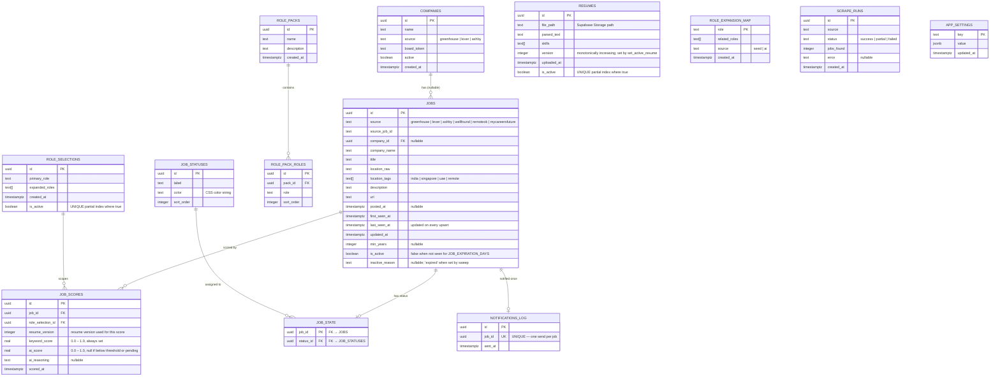

# Entity Relationship Diagram

## Full ERD



---

## Key Constraints

| Table | Constraint | Purpose |
|---|---|---|
| `jobs` | `UNIQUE (source, source_job_id)` | Dedup on every ingest run |
| `jobs` | `GIN INDEX (location_tags)` | Fast array containment queries |
| `job_scores` | `UNIQUE (job_id, role_selection_id, resume_version)` | One score per job+role+resume-version triple; prior-version rows preserved |
| `job_scores` | `INDEX (ai_score DESC NULLS LAST)` | Dashboard sorted by relevance |
| `resumes` | `UNIQUE (is_active) WHERE is_active = true` | Enforce single active resume |
| `role_selections` | `UNIQUE (is_active) WHERE is_active = true` | Enforce single active role |
| `notifications_log` | `UNIQUE (job_id)` | Guarantee at-most-one Telegram send |
| `role_pack_roles` | `INDEX (pack_id)` | Fast lookup of roles for a pack |
| `companies` | `UNIQUE (source, board_token) WHERE board_token IS NOT NULL` | No duplicate board configs |

---

## Database Functions (RPC)

### `set_active_resume(file_path, parsed_text, skills[])`

```
1. Compute next_version = MAX(version) + 1
2. UPDATE resumes SET is_active = false   -- deactivate previous
3. INSERT INTO resumes (…, is_active = true, version = next_version)  -- activate new
4. RETURN new row
```

### `set_active_role_selection(primary_role, expanded_roles[])`

```
1. UPDATE role_selections SET is_active = false   -- deactivate previous
2. INSERT INTO role_selections (…, is_active = true)  -- activate new
3. RETURN new row
```

Both functions run in a single transaction, ensuring exactly one active record at all times.

---

## Enum Values

```
job_source        → greenhouse, lever, ashby, wellfound, remoteok, mycareersfuture
location_tag      → india, singapore, uae, remote
role_map_source   → seed, ai
scrape_run_status → success, partial, failed
```

---

## Storage

| Bucket | Access | Content |
|---|---|---|
| `resumes` | Private — `authenticated` role only | Uploaded PDF files; path stored in `resumes.file_path` |
