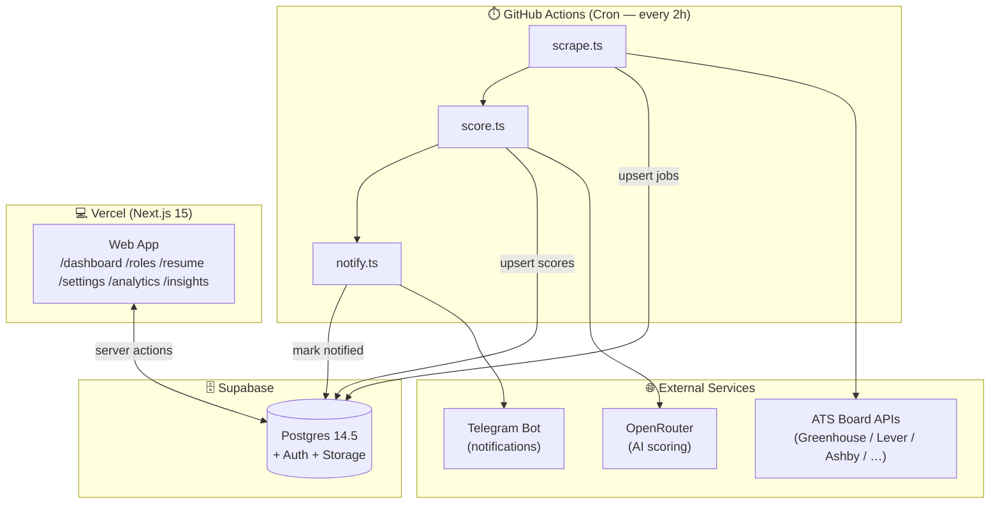
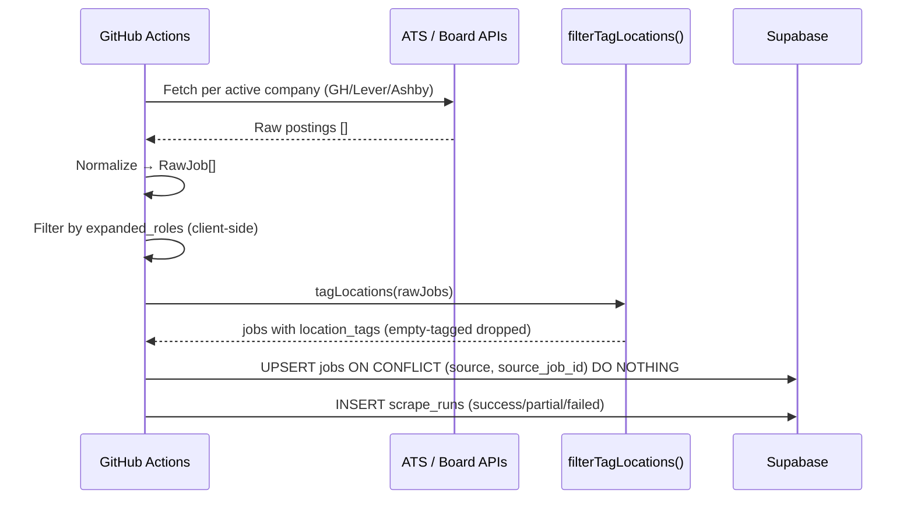
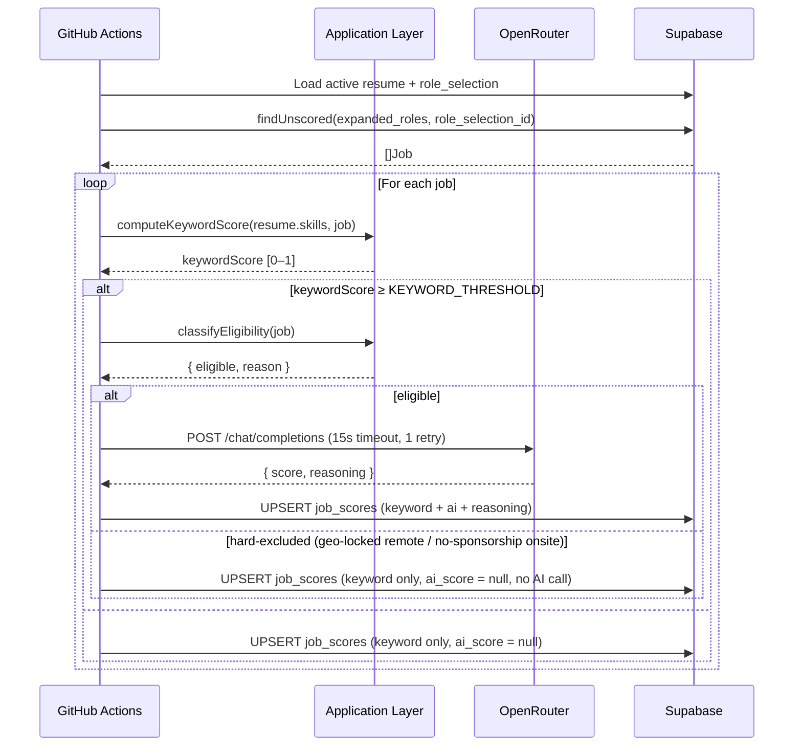
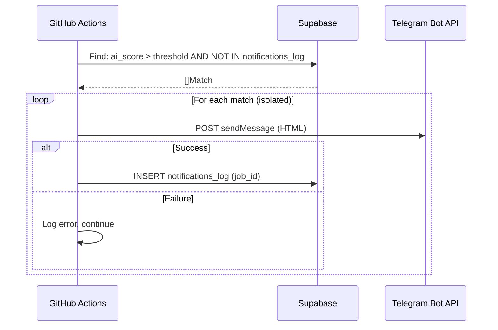
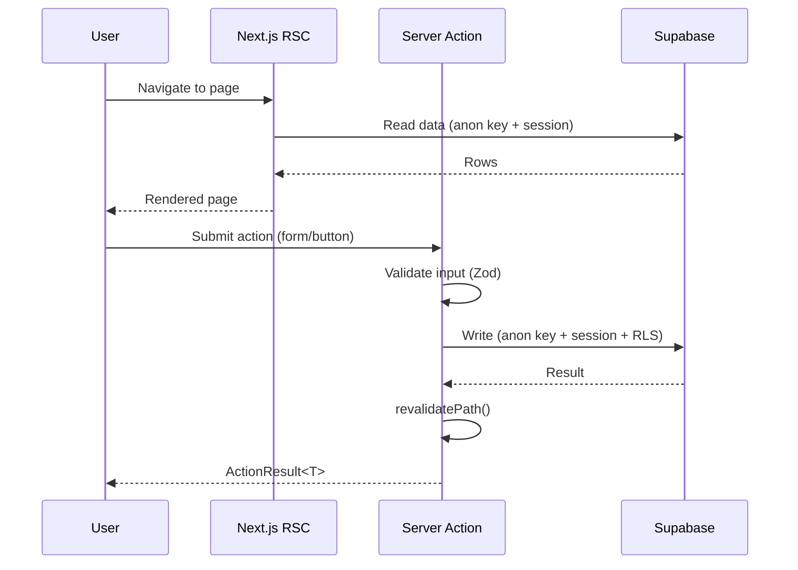

# Technical Design — Job Intelligence Platform

## 1. Overview

The Job Intelligence Platform is a single-user, self-hosted web application that automates job discovery, filtering, scoring, and notification. It scrapes postings from six ATS/job-board sources, enriches them with AI-powered relevance scoring, and delivers high-match alerts over Telegram — all driven by the user's uploaded resume and chosen target role.

## 2. Goals

| Goal | Description |
|---|---|
| Automated discovery | Continuously ingest fresh postings from Greenhouse, Lever, Ashby, Wellfound, RemoteOK, and MyCareersFuture |
| Relevance filtering | Surface only postings relevant to the user's role and geography |
| Two-stage scoring | Cheap keyword pass first; expensive AI call only for strong keyword matches |
| Proactive notification | Telegram alerts for postings that pass the AI threshold |
| Self-service configuration | Web UI for resume, role, company board-tokens, and status workflow |
| Observability | Scrape-run logs with timing, count metrics, and failure visibility; see [docs/operations/observability.md](../docs/operations/observability.md) |

## 3. Non-Goals

- Multi-user / multi-tenant support
- Applying to jobs on the user's behalf
- Resume generation or editing beyond skill tagging
- Job aggregation across geographies outside India, Singapore, UAE, Remote

## 4. Design Principles

1. **Clean Architecture** — domain → application → infrastructure; no circular dependencies.
2. **Single Source of Truth** — Supabase Postgres is the only database; no secondary caches outside the database.
3. **Fail-safe scoring** — AI failures leave `ai_score` null; the scoring script retries on the next cron run.
4. **At-most-once notifications** — `notifications_log` with a unique job_id index prevents duplicate Telegram messages.
5. **Service-role isolation** — `SUPABASE_SERVICE_ROLE_KEY` is used exclusively in cron scripts, never in app/ code.
6. **Explicit over implicit** — all server actions return typed `ActionResult<T>`; errors are never silently swallowed.

## 5. System Components

## 6. Data Flow

### 6.1 Scrape Pipeline

### 6.2 Scoring Pipeline

`classifyEligibility()` (`src/features/scoring/domain/classifyEligibility.ts`) is a pure, deterministic
function over `locationRaw`/`locationTags`/`description` -- no new call, no new table. The OpenRouter
system prompt built by `OpenRouterAiScoreProvider.buildSystemPrompt()` now also injects the candidate's
constraints from `shared/config/candidate-constraints.ts` (location/sponsorship need, ~years
experience, primary/secondary stack) so the model itself penalizes seniority and stack mismatches, and
treats a sponsorship-silent onsite posting as at most "worth reviewing".

### 6.3 Notification Pipeline

### 6.4 User Interaction (Web)

## 7. Key Modules

| Module | Path | Responsibility |
|---|---|---|
| sources | `src/features/sources` | Six ATS/board scrapers, RawJob normalization |
| jobs | `src/features/jobs` | Persistence, dedup, dashboard queries, status CRUD |
| filtering | `src/features/filtering` | Location tag inference from raw location strings |
| resume | `src/features/resume` | PDF/DOCX upload, text extraction, skill tagging, AI resume coaching + apply-as-new-version (decisions.md AD-32/AD-33) |
| roles | `src/features/roles` | Role selection, AI expansion, role_expansion_map cache |
| scoring | `src/features/scoring` | Two-stage keyword+AI scoring pipeline |
| notifications | `src/features/notifications` | Telegram message formatting and delivery |
| applications | `src/features/applications` | AI application drafting (email/cover letter), review/edit, mailto-only send, status tracking (decisions.md AD-34) |
| insights | `src/features/insights` | Analytics computations (skill gaps, charts) |
| companies | `src/features/companies` | Board-token CRUD for Greenhouse/Lever/Ashby |
| settings | `src/features/settings` | User preferences (desired experience years) |
| verification | `src/features/verification` | Production verification framework (v1.4): generic `Check`/`CheckResult` runner + health score, 24 concrete checks reusing existing repositories/reports |
| shared | `src/shared` | HTTP utilities, Supabase clients, domain primitives |

## 8. Error Handling Strategy

| Scenario | Behavior |
|---|---|
| Scraper returns empty results | Log `scrape_run` as `partial`; continue with other sources |
| AI call times out | Leave `ai_score` null; retried automatically on next scoring run |
| Telegram rate-limited | Honor `retry_after` header (capped 30s); retry once |
| Server action fails | Return `{ ok: false, error: string }` — never throw to client |
| Supabase `PostgrestError` thrown | `toAppError()` (`src/shared/infrastructure/supabaseError.ts`) wraps it in a native `Error` with a readable message before it propagates |
| Uncaught RSC error | Caught by `src/app/error.tsx` (route segment) or `src/app/global-error.tsx` (root fallback); user sees a readable message + "Try again" button |
| Service-role in `app/` | Blocked by CI check (`npm run check:service-role-boundary`) |

## 9. Worth Reviewing Correctness Notes

### Webhook score versioning (F1 + F2)

`digest_sessions` stores `resume_version` (added in migration `20260622000002`). The Telegram webhook (`POST /api/telegram/webhook`) scopes its `job_scores` fetch to `(role_selection_id, resume_version)` from the session row, ensuring the paginated display matches the score band used when the digest was originally sent. Without this, a post-upload re-score could expose stale scores via `job_scores[0]`.

### Dashboard `minAiScore` filter join type (F3)

`findForDashboard` in `SupabaseJobRepository` uses a conditional join type: `job_scores!inner` when `filters.minAiScore` is set, `job_scores!left` otherwise. PostgREST's `!left` join narrows the embedded array but does not exclude the parent row — meaning unfiltered jobs appear as `aiScore: null`. Switching to `!inner` when a score threshold is active ensures only qualifying jobs are returned, making the `/dashboard?minScore=0.80` deep-link from Telegram behave correctly.

### Dashboard stats scope (F4)

`countJobStats` queries `job_scores` directly with COUNT aggregates, not from the paged `findForDashboard` result. This decouples the stat line from `DEFAULT_JOBS_LIMIT = 50`, so `scoredCount` and `pendingCount` reflect the full dataset rather than the current page.

## 10. Configuration

All runtime behaviour is controlled via environment variables. See [tech-stack.md](tech-stack.md) for the full list and defaults.

## 10. Testing Approach

- **Unit tests** with vitest covering all application-layer use-cases and infrastructure adapters.
- **Mocked dependencies** — no live network or database calls in tests.
- **CI gate** — type-check, unit tests, and service-role boundary check must pass before merge.
- No end-to-end or integration tests (single-user app; manual verification against dev Supabase).
