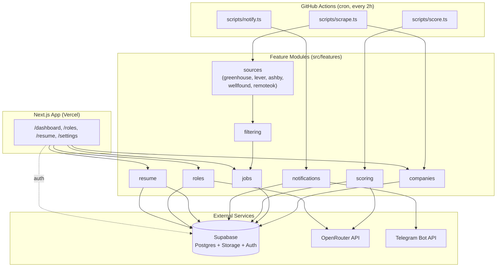
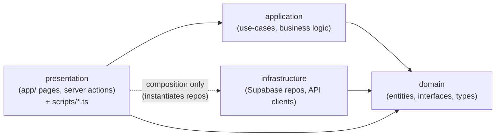

# Architecture

> **Canonical architecture doc is [`design/architecture.md`](../design/architecture.md)** (kept current under CLAUDE.md's Document Maintenance Rules). This file predates it and is retained only for its request/data-flow prose (§3.4 Role Selection, §3.5 Resume Upload, §3.6 Dashboard Read) not duplicated there. Everything else below overlaps `design/architecture.md` — treat that file as the source of truth if the two ever disagree.

## 1. System Overview

The Job Intelligence Platform is a **single-user** application that:

1. Scrapes job postings from five sources (Greenhouse, Lever, Ashby, Wellfound, RemoteOK).
2. Filters postings to those located in India, Singapore, UAE, or Remote.
3. Lets the user pick a primary role and expands it into related roles (e.g. *Full Stack Developer* → *Frontend Developer*, *Backend Developer*, *React Developer*, ...).
4. Scores filtered jobs against the user's uploaded resume using a two-stage pipeline (cheap keyword scoring, then AI refinement only for high-confidence candidates).
5. Persists everything in Supabase (Postgres + Storage + Auth).
6. Sends Telegram notifications for new high-confidence matches.

The system has two runtime contexts that **share the same `src/` codebase**:

- **Next.js app** (deployed to Vercel) — dashboard, role selection, resume upload, settings. Read-heavy, user-facing.
- **GitHub Actions scripts** (`scripts/*.ts`, run via `tsx` on a cron schedule) — scraping, scoring, notification. Write-heavy, unattended.

Both contexts call into the same `features/*/application` use-cases, which depend on `features/*/domain` interfaces implemented by `features/*/infrastructure`. Neither context contains business logic the other doesn't have access to — there is one codebase, two entrypoints.

## 2. Component Diagram



## 3. Request / Data Flow

### 3.1 Scrape → Filter → Ingest (cron, `scripts/scrape.ts`)

```
1. Load active rows from `companies` table
2. For each source adapter (greenhouse/lever/ashby):
     - For each company with that source, call adapter.fetchJobs(boardToken)
   For wellfound/remoteok adapters (no board token needed):
     - call adapter.fetchJobs()
3. Each adapter returns RawJob[] (normalized shape, see scrapers.md)
4. filtering.application.tagLocations(rawJobs) -> attaches location_tags[]
5. Drop any RawJob with empty location_tags (no india/singapore/uae/remote match)
6. jobs.application.ingestJobs(taggedJobs)
     -> SupabaseJobRepository.upsert on (source, source_job_id)
     -> first_seen_at set only on first insert
7. Write one row per source to scrape_runs (status, jobs_found, error)
```

### 3.2 Score (cron, `scripts/score.ts`, runs after scrape)

```
1. Load active resume (resumes.skills) and active role_selection (expanded_roles)
2. jobs.application.findUnscored(role_selection_id)
     -> jobs with no job_scores row for this role_selection,
        whose title matches one of expanded_roles
3. For each job:
     scoring.application.scoreJob(job, resume, role_selection_id, deps) -> NewJobScore
       a. computeKeywordScore(job, resumeSkills) -> keyword_score
       b. if keyword_score >= KEYWORD_THRESHOLD:
            aiScoreProvider.score(job, resume) -> ai_score, ai_reasoning
          else: ai_score/ai_reasoning stay null
       c. insert job_scores row
```

### 3.3 Notify (cron, `scripts/notify.ts`, runs after score)

```
1. notifications.application.sendNotification(role_selection_id, deps)
     -> deps.notificationRepository.findUnnotifiedMatches(role_selection_id, NOTIFY_THRESHOLD)
        (jobs where ai_score >= NOTIFY_THRESHOLD and no notifications_log row for job_id)
     -> for each match: send Telegram message, then markNotified(job_id) -- one-time guarantee
2. Each match is isolated (try/catch) -- a failed send doesn't block markNotified for the rest
```

### 3.4 Role Selection (interactive, `/roles` page)

```
1. User enters primary_role (e.g. "Full Stack Developer")
2. roles.application.expandRole(primary_role):
     - lookup role_expansion_map by primary_role
     - if found: return related_roles (source='seed' or 'ai')
     - if not found: one OpenRouter call -> related_roles,
       write to role_expansion_map (source='ai'), return result
3. User confirms -> new role_selections row created, is_active=true,
   previous active row set is_active=false
4. Next score.ts run picks up the new active role_selection
```

### 3.5 Resume Upload (interactive, `/resume` page)

```
1. User uploads PDF
2. resume.application.uploadResume(file):
     - store file in Supabase Storage
     - parse text (pdfjs-dist)
     - extract skills via keyword-dictionary match (no AI)
     - insert resumes row, is_active=true, previous active set false
3. User may manually edit/add skills (overrides extracted list)
```

### 3.6 Dashboard Read (`/dashboard` page)

```
1. Server component reads jobs JOIN job_scores
   WHERE job_scores.role_selection_id = active role_selection
2. Rendered as a table, sortable by ai_score, filterable by location_tags/source
3. No writes happen from this page except role/resume/company management,
   which go through their own application use-cases via server actions
```

## 4. Feature Boundaries

| Feature | Responsibility | Depends on | Exposes |
|---|---|---|---|
| `sources` | One adapter per ATS/job board; fetch + normalize raw postings into `RawJob[]` | nothing (pure fetch + parse) | `JobSourceScraper` interface + 5 implementations |
| `companies` | CRUD for company board-token config | `shared/supabase` | `CompanyRepository`, `listActiveCompanies()` |
| `filtering` | Tag `RawJob[]` with `location_tags` (india/singapore/uae/remote), drop unmatched | nothing (pure functions) | `tagLocations(rawJobs)` |
| `jobs` | Persist normalized jobs, dedup/upsert, query for scoring/dashboard | `shared/supabase` | `JobRepository`, `ingestJobs()`, `findUnscored()` |
| `roles` | Role expansion (static map + AI fallback), active role selection | `shared/supabase`, OpenRouter client | `RoleRepository`, `expandRole()`, `setActiveRoleSelection()` |
| `resume` | Resume upload, parsing, skill extraction | `shared/supabase` (Storage + DB) | `ResumeRepository`, `uploadResume()` |
| `scoring` | Two-stage scoring: keyword overlap + AI refinement | `shared/supabase`, OpenRouter client, `jobs`, `resume` domain types | `ScoreRepository`, `scoreJob()` |
| `notifications` | Telegram alerts, one-time send guarantee | `shared/supabase`, Telegram client | `NotificationRepository`, `sendNotification()` |
| `insights` | Skill-gap + demand views (P1); analytics aggregations — jobs over time, by source, score histogram, status breakdown (P3) | `shared/supabase`, `shared/domain/skills`, `shared/infrastructure/roleFilter` | `MatchedJobsRepository` (+ `getScrapeRuns`, `getAiScores`, `getStatusBreakdown`), `computeSkillGaps()`, `computeSkillDemand()`, `computeJobsOverTime()`, `computeJobsBySource()`, `bucketScores()` |
| `settings` | Editable user settings (desired experience years) backed by `app_settings` (P2) | `shared/supabase` | `SettingsRepository`, `setDesiredExperience()` |

**Cross-feature rule:** a feature may import another feature's `domain` types (e.g. `scoring` imports the `Job` and `Resume` entity types from `jobs/domain` and `resume/domain`), but **never** another feature's `infrastructure`. All cross-feature orchestration happens in `scripts/*.ts` or `app/**/page.tsx` (composition roots), which wire concrete repositories into use-cases.

## 5. Dependency Rules



Rules, in order of strictness:

1. **`domain` has zero dependencies** on other layers, Supabase, or external APIs. Pure TypeScript types and interfaces only.
2. **`application` depends only on `domain`** (interfaces, entities). It never imports `infrastructure` directly — repositories are injected as constructor/function arguments, typed by their `domain` interface.
3. **`infrastructure` implements `domain` interfaces** and is the only layer allowed to import Supabase client, OpenRouter SDK, Telegram client, `pdfjs-dist`, etc.
4. **`presentation` (Next.js `app/` and `scripts/*.ts`) is the composition root** — the only place where `infrastructure` classes are instantiated and passed into `application` use-cases. This keeps use-cases testable with mock repositories and keeps both runtime entrypoints (web app, cron scripts) calling identical logic.
5. **No feature imports another feature's `infrastructure`.** Shared low-level clients (Supabase client factory, OpenRouter client, Telegram client, logger, config) live in `shared/` and are imported by any `infrastructure` module that needs them. Example: the PostgREST role-match `.or()` filter builder is in `shared/infrastructure/roleFilter.ts` so both `jobs` and `insights` repositories use it without crossing this boundary.
6. **`shared/` has no dependency on `features/`** — it is the lowest layer, importable from anywhere.
