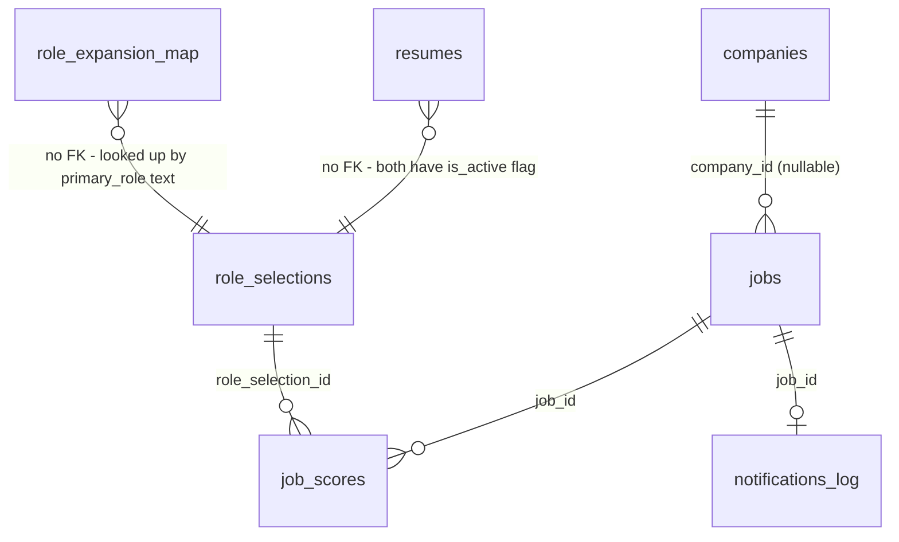

# Database (Supabase / Postgres)

Single-user app: no `user_id` columns. Supabase Auth provides the login gate for the Next.js app; cron scripts use the **service role key** (bypasses RLS).

## 1. Enums

```sql
create type job_source as enum ('greenhouse', 'lever', 'ashby', 'wellfound', 'remoteok');
create type location_tag as enum ('india', 'singapore', 'uae', 'remote');
create type role_map_source as enum ('seed', 'ai');
create type scrape_run_status as enum ('success', 'partial', 'failed');
```

## 2. Full Schema

```sql
-- ============================================================
-- companies: board-token config for ATS sources (greenhouse/lever/ashby).
-- wellfound/remoteok use generic feeds and don't need rows here.
-- ============================================================
create table companies (
  id           uuid primary key default gen_random_uuid(),
  name         text not null,
  source       job_source not null,
  board_token  text,                 -- null for sources that don't use one
  active       boolean not null default true,
  created_at   timestamptz not null default now()
);

-- one board_token per source (ignore nulls)
create unique index companies_source_token_uq
  on companies (source, board_token)
  where board_token is not null;

create index companies_active_idx on companies (source) where active = true;


-- ============================================================
-- jobs: normalized postings, deduped by (source, source_job_id)
-- ============================================================
create table jobs (
  id              uuid primary key default gen_random_uuid(),
  source          job_source not null,
  source_job_id   text not null,
  company_id      uuid references companies(id) on delete set null,
  company_name    text not null,
  title           text not null,
  location_raw    text not null default '',
  location_tags   location_tag[] not null default '{}',
  description     text not null default '',
  url             text not null,
  posted_at       timestamptz,
  first_seen_at   timestamptz not null default now(),
  updated_at      timestamptz not null default now(),
  min_years       integer,              -- P2: soft experience signal, parsed at ingest; NULL = unknown

  unique (source, source_job_id)
);

create index jobs_location_tags_idx on jobs using gin (location_tags);
create index jobs_posted_at_idx on jobs (posted_at desc);
create index jobs_first_seen_idx on jobs (first_seen_at desc);


-- ============================================================
-- resumes: uploaded resume + extracted skills. One active at a time.
-- ============================================================
create table resumes (
  id           uuid primary key default gen_random_uuid(),
  file_path    text not null,        -- Supabase Storage path
  parsed_text  text not null default '',
  skills       text[] not null default '{}',
  uploaded_at  timestamptz not null default now(),
  is_active    boolean not null default false
);

create unique index resumes_single_active_uq
  on resumes (is_active)
  where is_active = true;


-- ============================================================
-- role_selections: history of role choices; one active at a time.
-- ============================================================
create table role_selections (
  id              uuid primary key default gen_random_uuid(),
  primary_role    text not null,
  expanded_roles  text[] not null,
  created_at      timestamptz not null default now(),
  is_active       boolean not null default false
);

create unique index role_selections_single_active_uq
  on role_selections (is_active)
  where is_active = true;


-- ============================================================
-- role_expansion_map: cache of role -> related roles (seed or AI-generated)
-- ============================================================
create table role_expansion_map (
  role           text primary key,   -- normalized lowercase, e.g. "full stack developer"
  related_roles  text[] not null,
  source         role_map_source not null,
  updated_at     timestamptz not null default now()
);


-- ============================================================
-- job_scores: per-(job, role_selection) score. job_scores rows are
-- never updated after scoring for a given role_selection -- if the
-- active role_selection changes, new rows are created for the new id.
-- ============================================================
create table job_scores (
  id                  uuid primary key default gen_random_uuid(),
  job_id              uuid not null references jobs(id) on delete cascade,
  role_selection_id   uuid not null references role_selections(id) on delete cascade,
  keyword_score       numeric(5,4) not null check (keyword_score >= 0 and keyword_score <= 1),
  ai_score            numeric(5,4) check (ai_score >= 0 and ai_score <= 1),
  ai_reasoning        text,
  scored_at           timestamptz not null default now(),

  unique (job_id, role_selection_id)
);

create index job_scores_ai_score_idx on job_scores (ai_score desc nulls last);
create index job_scores_role_selection_idx on job_scores (role_selection_id);


-- ============================================================
-- notifications_log: one row per job ever notified (idempotency guard)
-- ============================================================
create table notifications_log (
  id       uuid primary key default gen_random_uuid(),
  job_id   uuid not null references jobs(id) on delete cascade,
  sent_at  timestamptz not null default now(),

  unique (job_id)
);


-- ============================================================
-- scrape_runs: observability log for cron runs, surfaced in /settings
-- ============================================================
create table scrape_runs (
  id          uuid primary key default gen_random_uuid(),
  source      job_source not null,
  status      scrape_run_status not null,
  jobs_found  integer not null default 0,
  error       text,
  run_at      timestamptz not null default now()
);

create index scrape_runs_run_at_idx on scrape_runs (run_at desc);


-- ============================================================
-- job_statuses: user-assignable status config (label + mild color).
-- Seeded (New/Interested/Applied/Rejected/Archived); full CRUD deferred.
-- Migration: 20260616000001_job_status.sql (P0).
-- ============================================================
create table job_statuses (
  id         uuid primary key default gen_random_uuid(),
  label      text not null unique,
  color      text not null,                 -- mild hex, e.g. '#E5E7EB'
  sort_order integer not null default 0,
  created_at timestamptz not null default now()
);


-- ============================================================
-- job_state: at most one status per job. No row => "unset" (rendered as New).
-- "Archive"/"remove" = setting the Archived status, NOT a DELETE -- the
-- scrape pipeline upserts on (source, source_job_id) and would re-insert a
-- hard-deleted row on the next cron run.
-- ============================================================
create table job_state (
  job_id     uuid primary key references jobs(id) on delete cascade,
  status_id  uuid references job_statuses(id) on delete set null,
  updated_at timestamptz not null default now()
);

create index job_state_status_idx on job_state (status_id);


-- ============================================================
-- app_settings: editable key/value config (P2), distinct from the read-only
-- env thresholds. Single-user app => flat key/value is enough.
-- Migration: 20260616000002_experience.sql. Current keys:
--   'desired_experience_years' -> number (dashboard soft year cap)
-- ============================================================
create table app_settings (
  key        text primary key,
  value      jsonb not null,
  updated_at timestamptz not null default now()
);
```

## 3. Table Purposes

| Table | Purpose |
|---|---|
| `companies` | Which companies' Greenhouse/Lever/Ashby boards to scrape (board tokens). Managed via `/settings`. |
| `jobs` | Canonical store of all scraped postings, deduped, tagged with allowed locations. |
| `resumes` | Uploaded resume file ref, parsed text, extracted skills. History kept; one `is_active`. |
| `role_selections` | History of the user's role choice + its expansion. History kept; one `is_active`. |
| `role_expansion_map` | Cache/config of role → related roles, seeded manually and extended by AI fallback. |
| `job_scores` | Per-job, per-role-selection score (keyword + optional AI). |
| `notifications_log` | Guarantees each job triggers at most one Telegram message. |
| `scrape_runs` | Per-source cron run history for debugging from the dashboard. `status` is currently `success`/`failed` only — `partial` reserved, not yet produced (decisions.md AD-13). |
| `job_statuses` | User-assignable status config (label + mild color). Seeded set; full CRUD deferred (P0). |
| `job_state` | At most one status per job (`job_id` PK). No row => unset/New. Archive = the `Archived` status, not a DELETE. |
| `app_settings` | Editable key/value config (P2), e.g. `desired_experience_years`. Distinct from read-only env thresholds. |

## 4. Relationships



Notes:
- `jobs.company_id` is nullable and `on delete set null` — RemoteOK/Wellfound jobs and any company later removed from `companies` don't orphan-delete jobs.
- `resumes` and `role_selections` are **not** foreign-keyed to each other; the scoring script reads "the active resume" and "the active role_selection" independently at run time.
- `role_expansion_map.role` is looked up by normalized text (lowercased `primary_role`), not a foreign key — it's a shared cache, not owned by any one `role_selections` row.

## 5. Constraints Summary

- **Dedup:** `jobs (source, source_job_id)` unique — re-scrapes upsert instead of duplicating.
- **Single active row:** partial unique indexes on `resumes.is_active` and `role_selections.is_active` enforce "at most one active" at the DB level (no app-level race possible).
- **Score bounds:** `job_scores.keyword_score` and `ai_score` constrained to `[0,1]`.
- **One score per (job, role_selection):** `job_scores (job_id, role_selection_id)` unique — re-running `score.ts` is idempotent (use `on conflict do nothing` or skip pre-check).
- **One notification per job, ever:** `notifications_log (job_id)` unique.

## 6. Indexes Summary

| Index | Purpose |
|---|---|
| `jobs_location_tags_idx` (GIN) | Dashboard filter by location tag |
| `jobs_posted_at_idx` | Dashboard default sort |
| `jobs_first_seen_idx` | "New since last visit" queries |
| `job_scores_ai_score_idx` | Dashboard sort by match score; notify.ts threshold query |
| `job_scores_role_selection_idx` | Score lookups scoped to active role_selection |
| `companies_active_idx` | scrape.ts loads only active companies, per source |
| `scrape_runs_run_at_idx` | Settings page recent-runs view |

## 7. Migration Strategy

- Managed via **Supabase CLI** migrations in `supabase/migrations/`, one file per change: `<timestamp>_<description>.sql` (e.g. `20260101120000_init_schema.sql`).
- Workflow: `supabase migration new <description>` → write SQL → `supabase db push` (or apply via CI) against the linked project.
- Enums are additive-only in practice: new values added via `alter type ... add value` in a new migration; never rename/remove enum values that existing rows reference.
- **Seed data** (`supabase/seed.sql`): initial `role_expansion_map` rows (`source='seed'`) for common dev role clusters, e.g. the Full Stack Developer example from the spec. Re-run via `supabase db reset` locally; not auto-applied to production (apply once manually or via a one-off migration that uses `insert ... on conflict do nothing`).
- **RLS:** enabled on all tables. A single policy per table allows `select`/`insert`/`update`/`delete` for the `authenticated` role (the one logged-in user) and the `service_role` key used by GH Actions scripts bypasses RLS entirely — no per-row ownership checks needed since there's only one user.
- Forward-only: no down-migrations are written for this personal project; if a change needs reverting, write a new forward migration that undoes it.

## 8. Storage

- **`resumes` bucket** (private): holds uploaded resume PDFs. Created by `20260612000007_storage_resumes.sql` via `insert into storage.buckets`, alongside a single `storage.objects` policy (`authenticated_full_access_resumes`) granting the `authenticated` role full access scoped to `bucket_id = 'resumes'` — same single-policy-per-table shape as table RLS (§7, AD-12).
- `resumes.file_path` (the table column, §2) stores the object path returned by `uploadResumeAction` (`<timestamp>-<uuid>.pdf`), not a full URL — the app resolves it against the `resumes` bucket at read time.
- Cron scripts don't touch this bucket; only the Next.js app (`features/resume/actions.ts`) reads/writes it, using the `authenticated` session (anon key + user session), so the bucket policy — not the service-role bypass — is what gates access.
